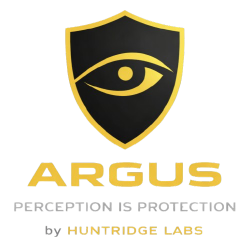

<div align="center">



<br>


[](https://codecov.io/gh/huntridge-labs/argus)

[](https://www.gnu.org/licenses/agpl-3.0)
[](https://github.com/eFAILution/AICaC)

<br>

Unified security scanning for GitHub Actions — SAST, containers, IaC, secrets, and DAST in a single workflow.

</div>

---

## Table of Contents

- [Quick Start](#quick-start)
- [Supported Scanners](#supported-scanners)
- [Features](#features)
- [GitHub Enterprise Server (GHES)](#github-enterprise-server-ghes)
- [Documentation](#documentation)
- [Usage Examples](#usage-examples)
- [Configuration](#configuration)
- [Contributing](#contributing)

## Quick Start

Create `.github/workflows/security-scan.yml`:

```yaml
name: Security Scan
on: [pull_request, push]

jobs:
  security:
    uses: huntridge-labs/argus/.github/workflows/security-scan.yml@0.3.0
    with:
      scanners: all
      enable_code_security: true
      post_pr_comment: true
      fail_on_severity: high
    secrets: inherit
```

## Supported Scanners

| Category | Scanner | Description |
|----------|---------|-------------|
| **SAST** | CodeQL | GitHub semantic code analysis |
| | Gitleaks | Secret detection in git history |
| | Bandit | Python security linter |
| | OpenGrep | Fast multi-language static analysis |
| **Container** | Trivy Container | Comprehensive vulnerability scanner |
| | Grype | Fast, accurate CVE detection |
| | Syft | Software Bill of Materials (SBOM) |
| **Infrastructure** | Trivy IaC | Infrastructure as Code scanner |
| | Checkov | Policy as Code for cloud configs |
| **Malware** | ClamAV | Open-source antivirus engine |
| **DAST** | ZAP | Dynamic testing of running web/API endpoints (opt-in) |

For detailed scanner configuration, see [Scanner Reference](docs/scanners.md).

## Features

- **Unified interface** - One workflow for all scanners
- **Flexible scanner selection** - Use `all`, scanner groups, or specific scanners
- **GitHub Security tab integration** - Upload SARIF results to Code Scanning
- **PR comments** - Inline feedback on pull requests
- **Severity-based failure control** - Set thresholds for workflow failures
- **Container configuration** - Scan multiple containers from a single config file
- **Matrix execution** - Parallel scanning for multiple targets
- **Private registry support** - Authenticate to container registries
- **Environment variable expansion** - Dynamic configuration values

## GitHub Enterprise Server (GHES)

GHES users can use our composite actions directly from github.com - no mirroring required.

**Architecture**: This project uses an actions-first architecture where all scanner logic lives in composite actions. The reusable workflows are thin wrappers for backwards compatibility on github.com.

<details>
<summary><strong>GHES Quick Start</strong></summary>

```yaml
name: Security Scan (GHES)

on: [pull_request, push]

permissions:
  contents: read
  security-events: write
  pull-requests: write

jobs:
  sast:
    runs-on: ubuntu-latest
    steps:
      - uses: actions/checkout@v6

      # Use composite actions directly from github.com
      - uses: huntridge-labs/argus/.github/actions/scanner-gitleaks@v2.12.0
        with:
          enable_code_security: true
          fail_on_severity: high
        env:
          GITHUB_TOKEN: ${{ secrets.GITHUB_TOKEN }}
          GITLEAKS_LICENSE: ${{ secrets.GITLEAKS_LICENSE }}

      - uses: huntridge-labs/argus/.github/actions/scanner-bandit@v2.12.0
        with:
          enable_code_security: true
          fail_on_severity: high
```

</details>

See [examples/github-enterprise/](examples/github-enterprise/) for complete GHES workflow templates:
- [SAST Scanning](examples/github-enterprise/sast-only.yml)
- [Container Scanning](examples/github-enterprise/container-scanning.yml)
- [Infrastructure Scanning](examples/github-enterprise/infrastructure-scanning.yml)
- [DAST Scanning](examples/github-enterprise/dast-scanning.yml)

## Documentation

### User Guides

- [Scanner Reference](docs/scanners.md) - Complete configuration for all scanners
- [Container Scanning](docs/container-scanning.md) - Config-driven matrix container scanning
- [Failure Control](docs/failure-control.md) - Severity-based workflow failure configuration

### Developer Docs

- [Contributing Guide](CONTRIBUTING.md) - How to add scanners and actions
- [Testing Guide](tests/CONTRIBUTING.md) - How to add and run tests
- [Release Management](docs/developer/release-management.md) - Release process and versioning
- [Enhanced PR Comments](docs/developer/enhanced-pr-comments.md) - PR comment implementation

## Usage Examples

<details>
<summary><strong>All Scanners with GitHub Security</strong></summary>

```yaml
name: Complete Security Scan

on:
  push:
    branches: [main]
  pull_request:
    branches: [main]
  schedule:
    - cron: '0 2 * * 1'  # Weekly Monday at 2 AM

permissions:
  contents: read
  security-events: write
  pull-requests: write

jobs:
  security:
    uses: huntridge-labs/argus/.github/workflows/security-scan.yml@0.3.0
    with:
      scanners: all
      enable_code_security: true
      post_pr_comment: true
      fail_on_severity: high
    secrets: inherit
```

</details>

<details>
<summary><strong>SAST Scanners Only</strong></summary>

```yaml
name: SAST Security Scan

on: [pull_request]

jobs:
  sast:
    uses: huntridge-labs/argus/.github/workflows/security-scan.yml@0.3.0
    with:
      scanners: codeql,bandit,opengrep,gitleaks
      codeql_languages: 'python,javascript'
      enable_code_security: true
      fail_on_severity: medium
    secrets:
      GITLEAKS_LICENSE: ${{ secrets.GITLEAKS_LICENSE }}
```

</details>

<details>
<summary><strong>Container Scanning</strong></summary>

```yaml
name: Container Security

on:
  push:
    tags: ['v*']

jobs:
  scan-image:
    uses: huntridge-labs/argus/.github/workflows/security-scan.yml@0.3.0
    with:
      scanners: trivy-container,grype,sbom
      image_ref: 'ghcr.io/myorg/myapp:${{ github.ref_name }}'
      enable_code_security: true
      fail_on_severity: critical
```

</details>

<details>
<summary><strong>Config-Driven Multiple Containers</strong></summary>

```yaml
name: Multi-Container Scan

on:
  push:
    paths: ['container-config.yml']

jobs:
  scan:
    uses: huntridge-labs/argus/.github/workflows/container-scan-from-config.yml@0.3.0
    with:
      config_file: container-config.yml
      enable_code_security: true
      fail_on_severity: high
    secrets: inherit
```

**container-config.yml:**

```yaml
containers:
  - name: frontend
    registry:
      host: ghcr.io
      username: ${GITHUB_TRIGGERING_ACTOR}
      auth_secret: GITHUB_TOKEN
    image:
      repository: myorg
      name: frontend
      tag: latest
    scanners:
      - trivy-container
      - grype

  - name: backend
    image: myorg/backend:latest
    scanners:
      - trivy-container
      - sbom
```

See [Container Scanning Guide](docs/container-scanning.md) for complete documentation.

</details>

<details>
<summary><strong>Infrastructure as Code</strong></summary>

```yaml
name: Infrastructure Security

on:
  pull_request:
    paths:
      - 'terraform/**'
      - 'infrastructure/**'

jobs:
  iac:
    uses: huntridge-labs/argus/.github/workflows/security-scan.yml@0.3.0
    with:
      scanners: trivy-iac,checkov
      iac_path: 'terraform/'
      enable_code_security: true
      fail_on_severity: high
```

</details>

<details>
<summary><strong>Branch-Specific Thresholds</strong></summary>

```yaml
name: Security with Branch Rules

on:
  pull_request:
    branches: ['**']

jobs:
  security:
    uses: huntridge-labs/argus/.github/workflows/security-scan.yml@0.3.0
    with:
      scanners: all
      enable_code_security: true
      post_pr_comment: true
      fail_on_severity: ${{ github.base_ref == 'main' && 'high' || 'critical' }}
    secrets: inherit
```

</details>

## Configuration

### Scanner Selection

- **All scanners:** `scanners: all`
- **By category:** `scanners: sast`, `scanners: container`, `scanners: infrastructure`
- **Specific scanners:** `scanners: codeql,trivy-container,gitleaks`
- **Multiple categories:** `scanners: sast,container`

### Common Inputs

| Input | Description | Default |
|-------|-------------|---------|
| `scanners` | Scanners to run (comma-separated or category) | Required |
| `enable_code_security` | Upload SARIF to GitHub Security tab | `false` |
| `post_pr_comment` | Post findings as PR comments | `true` |
| `fail_on_severity` | Fail workflow on severity threshold | `none` |

**Severity levels:** `none`, `low`, `medium`, `high`, `critical`

See [Failure Control Guide](docs/failure-control.md) for detailed threshold configuration.

### Permissions Required

```yaml
permissions:
  contents: read           # Read repository content
  security-events: write   # Upload to GitHub Security tab
  pull-requests: write     # Post PR comments
  actions: read           # Read Actions artifacts
```

### Secrets

Most secrets are optional and inherited via `secrets: inherit`. Scanner-specific secrets:

| Secret | Required For | Description |
|--------|-------------|-------------|
| `GITLEAKS_LICENSE` | Gitleaks (organizations) | License from [gitleaks.io](https://gitleaks.io) |
| `GITHUB_TOKEN` | PR comments, Security tab | Automatically provided |
| Registry secrets | Private containers | Token for authentication |

## Contributing

Contributions welcome! See [CONTRIBUTING.md](CONTRIBUTING.md) for guidelines.

### Development Setup

**Quick Start with Dev Container (Recommended):**

[](https://vscode.dev/redirect?url=vscode://ms-vscode-remote.remote-containers/cloneInVolume?url=https://github.com/huntridge-labs/argus)

1. Install [VS Code](https://code.visualstudio.com/) + [Dev Containers extension](https://marketplace.visualstudio.com/items?itemName=ms-vscode-remote.remote-containers)
2. Open repository → "Reopen in Container"
3. All dependencies ready! Run `npm test`

See [.devcontainer/README.md](.devcontainer/README.md) for details.

- Code of Conduct
- Development setup
- Pull request process
- Commit message format

### Development Setup

```bash
# Install dependencies
npm install
pip install -r .devcontainer/requirements.txt

# Run tests
npm test

# See tests/CONTRIBUTING.md for detailed testing guide
```

## License

AGPL v3 License - see [LICENSE.md](LICENSE.md) for details.

## Support

- **Issues:** [GitHub Issues](https://github.com/huntridge-labs/argusissues)
- **Discussions:** [GitHub Discussions](https://github.com/huntridge-labs/argusdiscussions)
- **Security:** See [SECURITY.md](SECURITY.md) for vulnerability reporting
