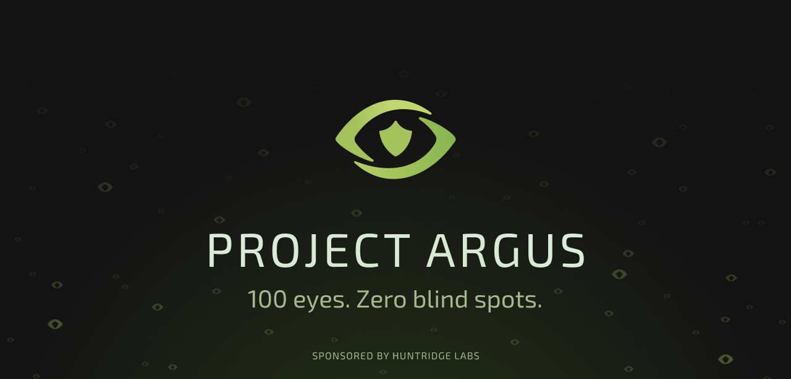

<div align="center">

<a href="http://argus.huntridgelabs.com/"></a>
<br>

<a href="http://argus.huntridgelabs.com/">Learn more at argus.huntridgelabs.com</a>

<br>


[](https://codecov.io/gh/huntridge-labs/argus)

[](https://www.gnu.org/licenses/agpl-3.0)
[](https://github.com/eFAILution/AICaC)

<br>

Unified security scanning — SAST, containers, IaC, secrets, and DAST from a single CLI or GitHub Actions workflow.

</div>

---

## Table of Contents

- [Quick Start](#quick-start)
- [Supported Scanners](#supported-scanners)
- [Features](#features)
- [GitHub Enterprise Server (GHES)](#github-enterprise-server-ghes)
- [Documentation](#documentation)
- [Usage Examples](#usage-examples)
- [Configuration](#configuration)
- [Contributing](#contributing)

## Quick Start

### Argus SDK (Recommended)

The argus Python SDK is the primary interface for running security scans. It works locally, in CI, and on any platform with Python 3.11+.

```bash
# Install from TestPyPI (pre-release — will become: pip install argus-security)
pip install -i https://test.pypi.org/simple/ --extra-index-url https://pypi.org/simple/ argus-security

# Initialize config and scan
argus init
argus scan
```

Or scan immediately without a config file:

```bash
argus scan bandit gitleaks osv --severity-threshold high
```

### Interactive triage

After a scan, `argus browse` opens a terminal UI for navigating findings —
filter by severity, product, or scanner; search by CVE; drill into details;
export to CSV / JSON / Markdown / SARIF; see an executive dashboard. Ships
behind an optional extra:

```bash
pip install 'argus-security[browse]'
argus browse                         # load ./argus-results/argus-results.json
argus scan --interactive             # scan, then drop straight into browse
```

Full keyboard reference and workflow in [`docs/browse.md`](docs/browse.md).

### GitHub Actions (Composite Actions)

For GitHub Actions users, composite actions remain available for direct integration:

```yaml
name: Security Scan
on: [pull_request, push]

permissions:
  contents: read
  security-events: write
  pull-requests: write

jobs:
  sast:
    runs-on: ubuntu-latest
    steps:
      - uses: actions/checkout@v6

      - uses: huntridge-labs/argus/.github/actions/scanner-gitleaks@0.7.0
        with:
          enable_code_security: true
          fail_on_severity: high
        env:
          GITHUB_TOKEN: ${{ secrets.GITHUB_TOKEN }}

      - uses: huntridge-labs/argus/.github/actions/scanner-bandit@0.7.0
        with:
          enable_code_security: true
          fail_on_severity: high
```

## Supported Scanners

| Category | Scanner | Description |
|----------|---------|-------------|
| **SAST** | CodeQL | GitHub semantic code analysis |
| | Gitleaks | Secret detection in git history |
| | Bandit | Python security linter |
| | OpenGrep | Fast multi-language static analysis |
| **Container** | Trivy Container | Comprehensive vulnerability scanner |
| | Grype | Fast, accurate CVE detection |
| | Syft | Software Bill of Materials (SBOM) |
| **Infrastructure** | Trivy IaC | Infrastructure as Code scanner |
| | Checkov | Policy as Code for cloud configs |
| **Malware** | ClamAV | Open-source antivirus engine |
| **DAST** | ZAP | Dynamic testing of running web/API endpoints (opt-in) |

For detailed scanner configuration, see [Scanner Reference](docs/scanners.md).

## Features

- **[Argus SDK](argus/)** - Run scanners locally or in CI with `argus scan`
- **[Unified interface](docs/scanners.md)** - One CLI or workflow for all scanners
- **[Flexible scanner selection](docs/scanners.md)** - Use scanner groups or specific scanners
- **[Interactive triage TUI](docs/browse.md)** - `argus browse` — keyboard-driven findings explorer with executive dashboard
- **[SBOM input](docs/cli-reference.md)** - `argus scan --sbom path/to/sbom.json` accepts CycloneDX / SPDX / Syft SBOMs (file or directory of SBOMs)
- **[GitHub Security tab integration](.github/actions/scanner-codeql/README.md)** - Upload SARIF results to Code Scanning
- **PR comments** - Inline feedback on pull requests
- **[Severity-based failure control](docs/failure-control.md)** - Set thresholds for workflow failures
- **[Container configuration](docs/container-scanning.md)** - Scan multiple containers from a single config file
- **Matrix execution** - Parallel scanning for multiple targets
- **Private registry support** - Authenticate to container registries
- **Environment variable expansion** - Dynamic configuration values
- **[Optional AI summary](.github/actions/ai-summary/README.md)** - Generate executive security summaries from scan results using your own AI provider and API key (Copilot, Claude, or Gemini)
- **[Interactive findings TUI](docs/browse.md)** - `argus browse` — keyboard-driven triage browser (`pip install 'argus-security[browse]'`)
- **[Local web UI](docs/serve.md)** - `argus serve` — localhost dashboard for non-engineer stakeholders (`pip install 'argus-security[serve]'`)

## GitHub Enterprise Server (GHES)

GHES users can use the argus SDK or composite actions directly from github.com - no mirroring required.

**Architecture**: Scanner logic lives in the argus Python SDK and in composite actions. The SDK is the primary interface; composite actions provide GitHub Actions integration.

<details>
<summary><strong>GHES Quick Start</strong></summary>

```yaml
name: Security Scan (GHES)

on: [pull_request, push]

permissions:
  contents: read
  security-events: write
  pull-requests: write

jobs:
  sast:
    runs-on: ubuntu-latest
    steps:
      - uses: actions/checkout@v6

      # Use composite actions directly from github.com
      - uses: huntridge-labs/argus/.github/actions/scanner-gitleaks@0.7.0
        with:
          enable_code_security: true
          fail_on_severity: high
        env:
          GITHUB_TOKEN: ${{ secrets.GITHUB_TOKEN }}
          GITLEAKS_LICENSE: ${{ secrets.GITLEAKS_LICENSE }}

      - uses: huntridge-labs/argus/.github/actions/scanner-bandit@0.7.0
        with:
          enable_code_security: true
          fail_on_severity: high
```

</details>

See [examples/github-enterprise/](examples/github-enterprise/) for complete GHES workflow templates:
- [SAST Scanning](examples/github-enterprise/sast-only.yml)
- [Container Scanning](examples/github-enterprise/container-scanning.yml)
- [Infrastructure Scanning](examples/github-enterprise/infrastructure-scanning.yml)
- [DAST Scanning](examples/github-enterprise/dast-scanning.yml)

## Documentation

**Full documentation:** [huntridge-labs.github.io/argus](https://huntridge-labs.github.io/argus/)

### User Guides

- [Configuration Reference](docs/config-reference.md) - Full `argus.yml` specification
- [Scanner Reference](docs/scanners.md) - Complete configuration for all scanners
- [Container Scanning](docs/container-scanning.md) - Config-driven matrix container scanning
- [Failure Control](docs/failure-control.md) - Severity-based workflow failure configuration

### Developer Docs

- [Contributing Guide](CONTRIBUTING.md) - How to add scanners and actions
- [Testing Guide](tests/CONTRIBUTING.md) - How to add and run tests
- [Release Management](docs/developer/release-management.md) - Release process and versioning
- [Enhanced PR Comments](docs/developer/enhanced-pr-comments.md) - PR comment implementation

## Usage Examples

<details>
<summary><strong>SDK: Full Scan with Config File</strong></summary>

```yaml
# argus.yml
scanners:
  - gitleaks
  - bandit
  - opengrep
  - osv
  - trivy-iac
  - checkov

scan_path: "."
severity_threshold: high
```

```bash
argus scan --config argus.yml
```

</details>

<details>
<summary><strong>SDK: SAST Scanners Only</strong></summary>

```bash
argus scan bandit opengrep gitleaks --severity-threshold medium
```

</details>

<details>
<summary><strong>SDK: Container Scanning</strong></summary>

```bash
argus scan container --severity-threshold critical
```

</details>

<details>
<summary><strong>SDK: Infrastructure as Code</strong></summary>

```yaml
# argus.yml
scanners:
  - trivy-iac
  - checkov

scan_path: "terraform/"
severity_threshold: high
```

```bash
argus scan --config argus.yml
```

</details>

<details>
<summary><strong>GitHub Actions: Composite Actions</strong></summary>

```yaml
name: Security Scan

on:
  push:
    branches: [main]
  pull_request:
    branches: [main]

permissions:
  contents: read
  security-events: write
  pull-requests: write

jobs:
  sast:
    runs-on: ubuntu-latest
    steps:
      - uses: actions/checkout@v6

      - uses: huntridge-labs/argus/.github/actions/scanner-gitleaks@0.7.0
        with:
          enable_code_security: true
          fail_on_severity: high
        env:
          GITHUB_TOKEN: ${{ secrets.GITHUB_TOKEN }}

      - uses: huntridge-labs/argus/.github/actions/scanner-bandit@0.7.0
        with:
          enable_code_security: true
          fail_on_severity: high
```

</details>

<details>
<summary><strong>GitHub Actions: Config-Driven Container Scanning</strong></summary>

See [Container Scanning Guide](docs/container-scanning.md) for complete documentation.

</details>

## Configuration

### SDK Configuration (argus.yml)

```yaml
scanners:
  - gitleaks
  - bandit
  - osv
  - trivy-iac

scan_path: "."
severity_threshold: high
```

### CLI Scanner Selection

```bash
# Specific scanners
argus scan gitleaks bandit osv

# With severity threshold
argus scan --severity-threshold high

# With config file
argus scan --config argus.yml
```

**Severity levels:** `none`, `low`, `medium`, `high`, `critical`

See [Failure Control Guide](docs/failure-control.md) for detailed threshold configuration.

### GitHub Actions Permissions

When using composite actions in GitHub Actions workflows:

```yaml
permissions:
  contents: read           # Read repository content
  security-events: write   # Upload to GitHub Security tab
  pull-requests: write     # Post PR comments
  actions: read           # Read Actions artifacts
```

### Secrets

Scanner-specific secrets (for GitHub Actions composite action usage):

| Secret | Required For | Description |
|--------|-------------|-------------|
| `GITLEAKS_LICENSE` | Gitleaks (organizations) | License from [gitleaks.io](https://gitleaks.io) |
| `GITHUB_TOKEN` | PR comments, Security tab | Automatically provided |
| Registry secrets | Private containers | Token for authentication |

## MCP Server (AI Integration)

Argus includes an MCP server for seamless AI assistant integration. AI tools like Claude, Copilot, and Cursor can run scans, validate configs, and detect project characteristics directly.

```bash
pip install argus-security[mcp]
```

Add to your AI tool's MCP configuration:

```json
{
  "mcpServers": {
    "argus": {"command": "argus", "args": ["mcp"]}
  }
}
```

Available tools: `argus_scan`, `argus_detect`, `argus_validate`, `argus_list_scanners`, `argus_init`

## Contributing

Contributions welcome! See [CONTRIBUTING.md](CONTRIBUTING.md) for guidelines.

### Development Setup

**Quick Start with Dev Container (Recommended):**

[](https://vscode.dev/redirect?url=vscode://ms-vscode-remote.remote-containers/cloneInVolume?url=https://github.com/huntridge-labs/argus)

1. Install [VS Code](https://code.visualstudio.com/) + [Dev Containers extension](https://marketplace.visualstudio.com/items?itemName=ms-vscode-remote.remote-containers)
2. Open repository → "Reopen in Container"
3. All dependencies ready! Run `npm test`

```bash
# Install dependencies
npm install
pip install -r .devcontainer/requirements.txt

# Run tests
npm test

# See tests/CONTRIBUTING.md for detailed testing guide
```

## License

AGPL v3 License - see [LICENSE.md](LICENSE.md) for details.

## Support

- **Documentation:** [huntridge-labs.github.io/argus](https://huntridge-labs.github.io/argus/)
- **Issues:** [GitHub Issues](https://github.com/huntridge-labs/argus/issues)
- **Discussions:** [GitHub Discussions](https://github.com/huntridge-labs/argus/discussions)
- **Security:** See [SECURITY.md](SECURITY.md) for vulnerability reporting
