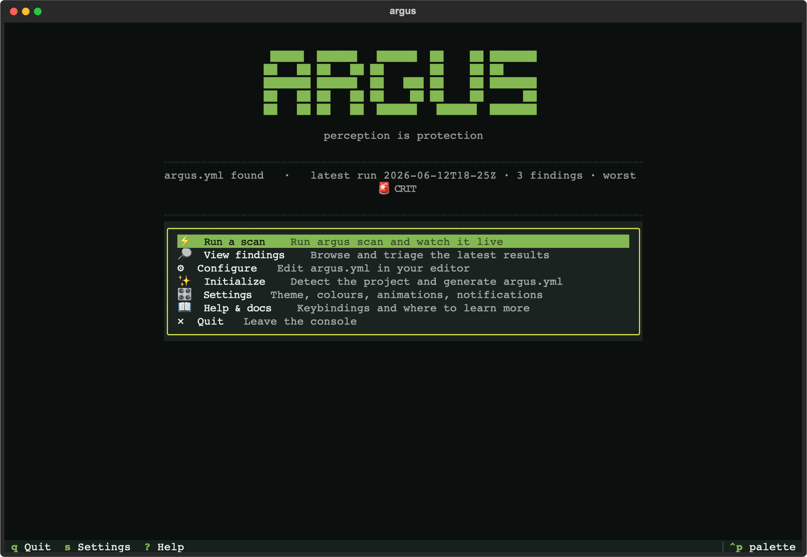
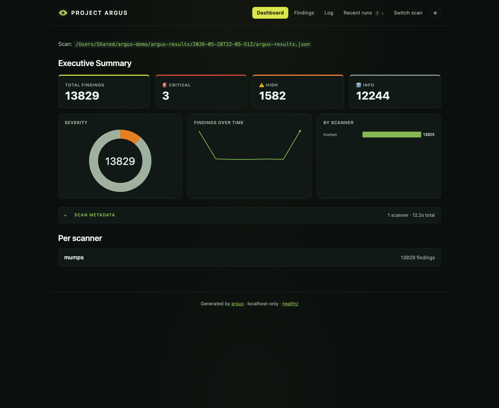
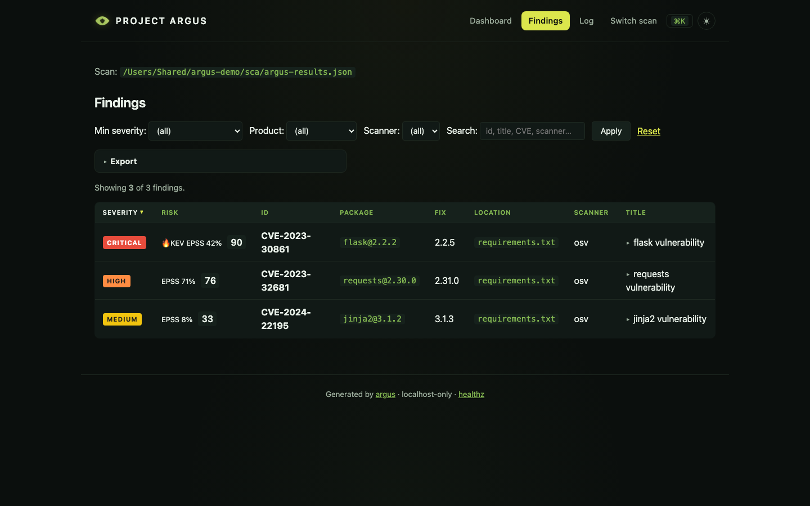

<div align="center">

<a href="http://argus.huntridgelabs.com/"></a>


[](https://codecov.io/gh/huntridge-labs/argus)
[](https://www.gnu.org/licenses/agpl-3.0)

<h3>Find it. Triage it. Prove it.</h3>

**Argus** unifies SAST, containers, IaC, secrets, DAST, and supply-chain scanning behind one CLI — then gives you a keyboard-driven **terminal Console** to triage what it finds and a one-click, **audit-ready PDF report** to prove what you shipped. Run it locally, in CI, or as GitHub Actions.

<a href="http://argus.huntridgelabs.com/"><strong>argus.huntridgelabs.com →</strong></a>

<br>

<table>
<tr>
<td width="33%" valign="top" align="center">
<a href="docs/view-terminal.md"></a>
<br><b>Terminal Console</b><br><sub>bare <code>argus</code> — scan, triage, fix</sub>
</td>
<td width="33%" valign="top" align="center">
<a href="docs/view-browser.md"></a>
<br><b>Browser dashboard</b><br><sub>charts, EPSS/KEV risk, light/dark</sub>
</td>
<td width="33%" valign="top" align="center">
<a href="docs/view-browser.md"></a>
<br><b>One-click PDF report</b><br><sub>provenance + attestation, hand-it-to-an-auditor</sub>
</td>
</tr>
</table>

</div>

---

## Why Argus

Most scanners stop at a wall of JSON. Argus takes you from **find → triage → prove**:

- **✦ Find it** — one CLI runs every scanner (SAST, secrets, dependencies, containers, IaC, DAST, supply-chain) with a single severity gate and SBOM input.
- **✦ Triage it** — a full **terminal Console** (and a local **browser dashboard**) to filter, search, enrich with live exploit intel (EPSS + CISA KEV), suppress to OpenVEX, apply deterministic fixes, and run scans without leaving the UI.
- **✦ Prove it** — cosign-verified tooling, a recorded provenance chain, and a formal **PDF report** binding findings to the exact commit and scanner image digests that produced them.

---

## Quick start

**1 — Scan from the CLI** (the SDK; Python 3.11+, works locally and in CI):

```bash
pip install argus-security
argus init          # detect the project, generate argus.yml
argus scan          # run the configured scanners
```

Or skip the config and scan immediately:

```bash
argus scan bandit gitleaks osv --severity-threshold high
```

**2 — Open the Console** (the interactive TUI):

```bash
pip install 'argus-security[terminal]'
argus               # bare argus opens the Console
```

**3 — Add it to GitHub Actions** (composite actions, GHES-friendly):

```yaml
- uses: huntridge-labs/argus/.github/actions/scanner-bandit@1.4.1
  with:
    enable_code_security: true   # upload SARIF to the Security tab
    fail_on_severity: high
  env:
    GITHUB_TOKEN: ${{ secrets.GITHUB_TOKEN }}
```

---

## ✦ Find it — the scanners

One interface, every layer of the stack. Tools run as local binaries or pinned, cosign-verified container images (auto-detected).

| Layer | Scanners |
|-------|----------|
| **SAST** | CodeQL · Bandit (Python) · gosec (Go) · OpenGrep (multi-language) · MUMPS/M |
| **Secrets** | Gitleaks (history + working tree) |
| **Dependencies** | OSV · GitHub Dependency Review (PR diff + license) |
| **Containers** | Trivy + Grype (CVEs, deduped) · Syft (SBOM) · exposed-port & service surface |
| **Infrastructure** | Trivy IaC · Checkov |
| **Supply chain** | zizmor + actionlint (GitHub Actions workflow security) |
| **Malware** | ClamAV |
| **DAST** | OWASP ZAP (running web/API endpoints, opt-in) |
| **Compliance** | FedRAMP SCN detection |
| **Linting** | YAML · JSON · Python · JavaScript · Dockerfile · Terraform · Shell |

```bash
argus scan --list                       # everything available
argus scan --sbom path/to/sbom.json     # scan a CycloneDX / SPDX / Syft SBOM
```

See the [Scanner Reference](docs/scanners.md) for per-scanner configuration.

---

## ✦ Triage it — the Console & browser

### The Argus Console (terminal)

Bare `argus` opens a home base for the whole local workflow — no flags to memorise.

<div align="center">

</div>

From the Console (or `argus view terminal` straight into the findings) you can:

- **Run scans in-app** (`R`) — stream `argus scan` live, reload results when it finishes.
- **Triage fast** — filter by severity / product / scanner, search by CVE, drill into details, multi-select, export to CSV / JSON / Markdown / SARIF.
- **Enrich with live intel** (`i`) — EPSS exploit probability + CISA KEV, re-ranking findings by *real-world* risk.
- **Suppress to OpenVEX** (`S`) — record a triage decision (false-positive / not-exploitable / accepted) that the next scan honours.
- **Apply deterministic fixes** (`F`) — propose + preview + apply Tier-1 dependency bumps.
- **Explain a finding** (`x`) — a local (Ollama) or cloud model walks you through it (opt-in, no key required to use Argus).
- **Switch & open scans** — a runs sidebar (`b`) for sibling runs and a filesystem picker (`O`) to open results from anywhere.
- **Configure & initialise** in-app, plus a **command palette** (`Ctrl+P`), a **system-readiness chip** (Docker / tools / image digests), and a **live-preview theme picker**.

Full keyboard reference: [`docs/view-terminal.md`](docs/view-terminal.md) · Console guide: [`docs/console.md`](docs/console.md).

### The browser viewer

For owners, managers, and execs who want at-a-glance posture without a terminal. Localhost-only, read-only, no auth to manage.

```bash
pip install 'argus-security[browser]'
argus view browser
```

<table>
<tr>
<td width="50%" valign="top" align="center">

<br><sub>Executive dashboard — dependency-free SVG charts, sticky scan-context bar, light/dark</sub>
</td>
<td width="50%" valign="top" align="center">

<br><sub>Findings table — opt-in EPSS/KEV <b>Risk</b> column, <code>⌘K</code> command palette</sub>
</td>
</tr>
</table>

Details: [`docs/view-browser.md`](docs/view-browser.md).

---

## ✦ Prove it — provenance & the formal report

Argus doesn't just find issues — it produces evidence you can hand to an auditor or a government body.

<div align="center">

</div>

- **One-click PDF report** (`argus view browser` → Report, `pip install 'argus-security[report]'`) — provenance & attestation block (Argus version, source commit, cosign-verified scanner image digests, signed-attestation status), a PASS/FAIL verdict, charts, and the full findings inventory grouped by severity. The HTML view prints to PDF even without the extra.
- **Supply-chain verification** — every Argus-owned image pull is cosign-verified (Sigstore keyless); third-party images are `@sha256:` digest-pinned. A failed verification aborts the scanner.
- **Signed attestations** — an OpenVEX-in-in-toto statement (subjects = scanned image digests + repo commit), cosign-signed and optionally registry-attached.
- **Credentials stay out of `argus.yml`** — reference an env var via `<field>_env` or pipe via stdin; resolved values never reach logs or the audit trail.

See the [Security Policy](docs/security.md) for the threat model, credential handling, and image-provenance details.

---

## GitHub Actions & GHES

Scanner logic lives in the Argus SDK and in self-contained composite actions, so GHES users consume them directly from github.com — no mirroring or reusable-workflow restrictions.

<details>
<summary><strong>Composite-action workflow</strong></summary>

```yaml
name: Security Scan
on: [pull_request, push]

permissions:
  contents: read
  security-events: write   # upload SARIF to the Security tab
  pull-requests: write     # post PR comments

jobs:
  sast:
    runs-on: ubuntu-latest
    steps:
      - uses: actions/checkout@v6
      - uses: huntridge-labs/argus/.github/actions/scanner-gitleaks@1.4.1
        with: { enable_code_security: true, fail_on_severity: high }
        env: { GITHUB_TOKEN: "${{ secrets.GITHUB_TOKEN }}" }
      - uses: huntridge-labs/argus/.github/actions/scanner-bandit@1.4.1
        with: { enable_code_security: true, fail_on_severity: high }
```

</details>

GHES templates: [SAST](examples/github-enterprise/sast-only.yml) · [Container](examples/github-enterprise/container-scanning.yml) · [Infrastructure](examples/github-enterprise/infrastructure-scanning.yml) · [DAST](examples/github-enterprise/dast-scanning.yml).

---

## Configuration

```yaml
# argus.yml
scanners:
  - gitleaks
  - bandit
  - osv
  - trivy-iac
scan_path: "."
severity_threshold: high     # none · low · medium · high · critical
```

```bash
argus scan --config argus.yml
argus scan gitleaks bandit osv          # ad-hoc scanner selection
argus completion zsh >> ~/.zshrc        # shell tab-completion
```

Full spec: [Configuration Reference](docs/config-reference.md) · [Failure Control](docs/failure-control.md) · [Container Scanning](docs/container-scanning.md).

---

## MCP server (AI integration)

Run scans, validate configs, classify IaC changes, and explain findings from Claude Desktop / Code, Cursor, Continue, or Cline — without leaving the chat.

```bash
uvx --from 'argus-security[mcp]' argus mcp     # zero-install
```

```json
{ "mcpServers": { "argus": { "command": "argus", "args": ["mcp"] } } }
```

Tools include `argus_scan`, `argus_validate`, `argus_explain_finding`, `argus_scan_summary`. Per-client setup + the full reference: [`docs/mcp.md`](docs/mcp.md).

---

## Documentation

**Full docs:** [huntridge-labs.github.io/argus](https://huntridge-labs.github.io/argus/)

| User guides | Developer |
|-------------|-----------|
| [Configuration Reference](docs/config-reference.md) | [Contributing](CONTRIBUTING.md) |
| [Scanner Reference](docs/scanners.md) | [Testing Guide](tests/CONTRIBUTING.md) |
| [Terminal Console](docs/view-terminal.md) · [Browser viewer](docs/view-browser.md) | [Release Management](docs/developer/release-management.md) |
| [Security Policy](docs/security.md) | [SDK Roadmap](docs/developer/SDK-ROADMAP.md) |
| [Docker Troubleshooting](docs/troubleshooting/docker.md) | [Migration 0.6.x → 1.x](docs/migration/0.6.x-to-1.x.md) |

---

## Contributing

Contributions welcome — see [CONTRIBUTING.md](CONTRIBUTING.md). Fastest path is the dev container:

[](https://vscode.dev/redirect?url=vscode://ms-vscode-remote.remote-containers/cloneInVolume?url=https://github.com/huntridge-labs/argus)

```bash
npm install
pip install -r .devcontainer/requirements.txt
npm test
```

---

## License & support

AGPL v3 — see [LICENSE.md](LICENSE.md). · [Issues](https://github.com/huntridge-labs/argus/issues) · [Discussions](https://github.com/huntridge-labs/argus/discussions) · [Security reporting](SECURITY.md)
