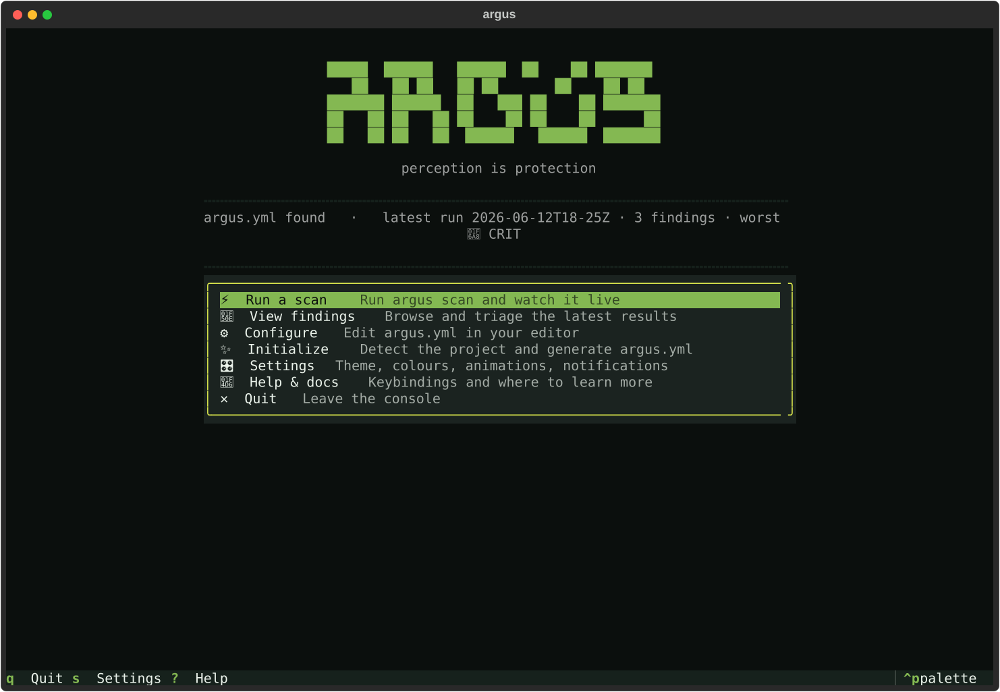
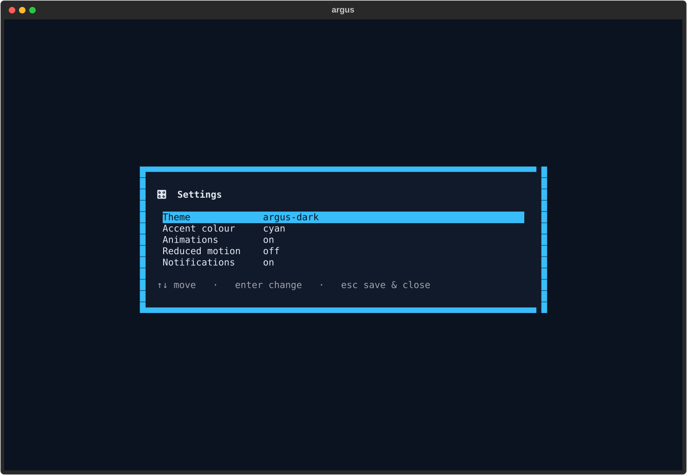

# Argus Console

Run `argus` with no subcommand in an interactive terminal and you land in
the **Argus Console** — a home base for the whole local workflow: run a
scan, browse findings, edit config, initialize a project, and tune your
preferences, all without leaving the terminal.



```bash
argus            # opens the Console (interactive terminals only)
argus view       # still jumps straight to the findings viewer
argus scan ...   # every subcommand is unchanged
```

> **Backward compatible by design.** The Console only opens when both
> stdout and stdin are a TTY. Piped, redirected, or CI invocations of a
> bare `argus` keep printing `--help` exactly as before, so scripts and
> pipelines are unaffected. If the `[terminal]` extra isn't installed,
> bare `argus` prints an install hint and falls back to help.

## The home screen

- **Wordmark + tagline**, with a tasteful fade-in (honours reduced-motion
  and the `ARGUS_NO_ANIMATION` env var).
- **Status line** — at a glance: whether an `argus.yml` exists, and the
  latest run's label, finding count, and worst severity (from the same
  run-discovery logic the viewers use).
- **Launcher menu** — arrow keys + Enter, or click:

  | Item | What it does |
  |---|---|
  | Run a scan | Runs `argus scan` and streams it live, then reloads. |
  | View findings | Opens the full triage viewer (same as `argus view`). |
  | Configure | Opens `argus.yml` in your `$EDITOR` / `$VISUAL`. |
  | Initialize | Runs `argus init` to detect the project + write config. |
  | Settings | Theme, accent colour, animations, notifications. |
  | Help & docs | Keybindings and where to learn more. |
  | Quit | Leave the console. |

## Settings

A keyboard- and mouse-friendly settings page. Move with the arrows, press
Enter to change the focused setting; theme and accent **preview live**,
and everything persists to `~/.config/argus/console.yml`
(XDG-aware — honours `$XDG_CONFIG_HOME`).



| Setting | Effect |
|---|---|
| Theme | Any of the built-in Textual themes plus the bespoke `argus-dark`. |
| Accent colour | Tints the `argus-dark` theme; previews instantly. |
| Animations | Master switch for motion (e.g. the home fade-in). |
| Reduced motion | Overrides Animations — turns all motion off (accessibility). |
| Notifications | Show or suppress in-app toast notifications. |

Settings are user preferences, kept separate from your project's
`argus.yml` scan configuration.

## Relationship to `argus view`

The Console and `argus view terminal` share the same findings viewer —
"View findings" opens it, and `argus view` is the direct deep-link. See
[`view-terminal.md`](view-terminal.md) for the full triage reference. The
broader plan for the Console (config editor, init wizard, vulnerability
mitigation) lives in
[`developer/CONSOLE-ROADMAP.md`](developer/CONSOLE-ROADMAP.md).
