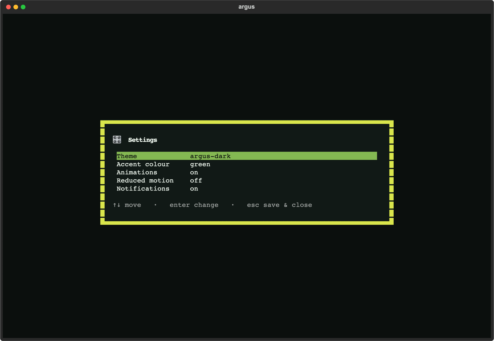

# Argus Console

Run `argus` with no subcommand in an interactive terminal and you land in
the **Argus Console** — a home base for the whole local workflow: run a
scan, browse findings, edit config, initialize a project, and tune your
preferences, all without leaving the terminal.


```bash
argus            # opens the Console (interactive terminals only)
argus view       # still jumps straight to the findings viewer
argus scan ...   # every subcommand is unchanged
```

> **Backward compatible by design.** The Console only opens when both
> stdout and stdin are a TTY. Piped, redirected, or CI invocations of a
> bare `argus` keep printing `--help` exactly as before, so scripts and
> pipelines are unaffected. If the `[terminal]` extra isn't installed,
> bare `argus` prints an install hint and falls back to help.

## The home screen

- **Wordmark + tagline**, with a tasteful fade-in (honours reduced-motion
  and the `ARGUS_NO_ANIMATION` env var).
- **Status line** — at a glance: whether an `argus.yml` exists, and the
  latest run's label, finding count, and worst severity (from the same
  run-discovery logic the viewers use).
- **System-readiness chip** — a single go/no-go line (`●` ready / `▲` warning
  / `✖` blocked) answering "can I scan right now, and with what?" *before* you
  hit a wall like "Docker isn't running". It checks the Docker daemon, how many
  common scanners are installed as local binaries, and whether cached Argus
  images match a published release digest. Computed in the background so the
  home paints instantly; press **`d`** to expand it into the full breakdown
  with remediation for anything that needs attention.
- **Launcher menu** — arrow keys + Enter, or click:

  | Item | What it does |
  |---|---|
  | Run a scan | Runs `argus scan` and streams it live, then reloads. |
  | View findings | Opens the full triage viewer (same as `argus view`). |
  | Configure | Opens the form editor for `argus.yml` (see below). |
  | Initialize | Guided first-run wizard — detect the project, review, write `argus.yml` (see below). |
  | Settings | Theme, accent colour, animations, notifications. |
  | Help & docs | Keybindings, where to learn more, and your terminal's detected graphics / hyperlink / truecolor support. |
  | Quit | Leave the console. |

- **Command palette** (`Ctrl+P`) — fuzzy-search and run any menu action
  without reaching for the mouse or memorising a key. Same palette the
  findings viewer offers, now on the home screen too.

## Configure

Edit `argus.yml` by form instead of by hand. Move with the arrows, press
Enter to cycle the focused setting, `s` to save, `esc` to discard. Each row
shows the current value and a one-line description of what it controls.

The form covers the common edits — scanner on/off toggles and the bounded
choice settings (`severity_threshold`, execution `backend` / `pull_policy`,
and the viewer's `cve_source` / `open_location`). Edits are
**comment-preserving**: only the matched line's value is rewritten, so your
comments, ordering, and indentation survive. Before saving, the edited file
is re-validated against the config schema — an invalid edit is refused with
the reason rather than written.

Settings that aren't toggle/choice fields (paths, URLs, custom args) and
adding a brand-new scanner block still go through Initialize or your
`$EDITOR`. If no `argus.yml` exists yet, Configure points you to Initialize
and falls back to `$EDITOR` / `$VISUAL` so you can create one by hand.

## Initialize

A guided first-run wizard, all in-app — no shelling out to the CLI. It runs
the same detection as `argus init`, shows what it found (languages,
dependency manifests, CI, infrastructure) and a one-line tool-readiness
summary, then lists the **proposed scanners** as toggles so you can turn any
off before writing. Press `w` to write `argus.yml`, or `r` to write **and**
jump straight into your first scan; `esc` cancels.

If an `argus.yml` already exists, the wizard says so and asks you to press
the write key a second time to confirm the overwrite — it never clobbers a
config silently. The detection and config generation are the exact pure
functions behind `argus init`; the wizard is just a frontend over them.

## Settings

A keyboard- and mouse-friendly settings page. Move with the arrows, press
Enter to change the focused setting; accent **previews live**, and everything
persists to `~/.config/argus/console.yml` (XDG-aware — honours
`$XDG_CONFIG_HOME`). **Theme** opens a live-preview dropdown: arrow up/down to
see each theme applied instantly, Enter to keep it, Esc to revert to the one
you started on.



| Setting | Effect |
|---|---|
| Theme | Any of the built-in Textual themes plus the bespoke `argus-dark` — chosen from a live-preview dropdown (↑↓ preview · Enter choose · Esc revert). |
| Accent colour | Tints the `argus-dark` theme; previews instantly. |
| Animations | Master switch for motion (e.g. the home fade-in). |
| Reduced motion | Overrides Animations — turns all motion off (accessibility). |
| Notifications | Show or suppress in-app toast notifications. |

Settings are user preferences, kept separate from your project's
`argus.yml` scan configuration.

## Relationship to `argus view`

The Console and `argus view terminal` share the same findings viewer —
"View findings" opens it, and `argus view` is the direct deep-link. See
[`view-terminal.md`](view-terminal.md) for the full triage reference. The
broader plan for the Console (deeper vulnerability mitigation and folding
the findings viewer in as a true in-app screen are next) lives in
[`developer/CONSOLE-ROADMAP.md`](developer/CONSOLE-ROADMAP.md).
