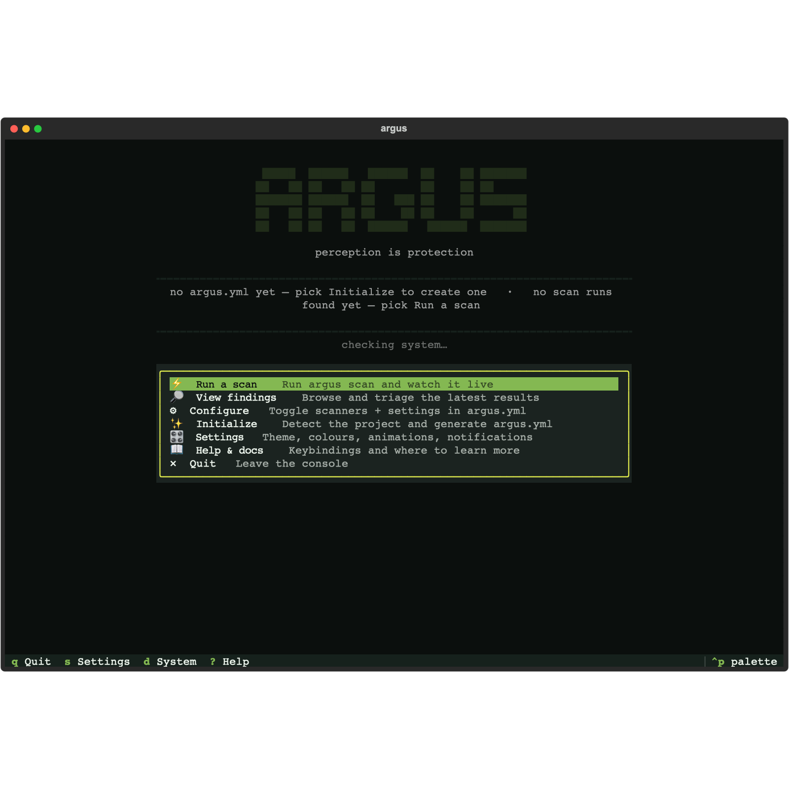
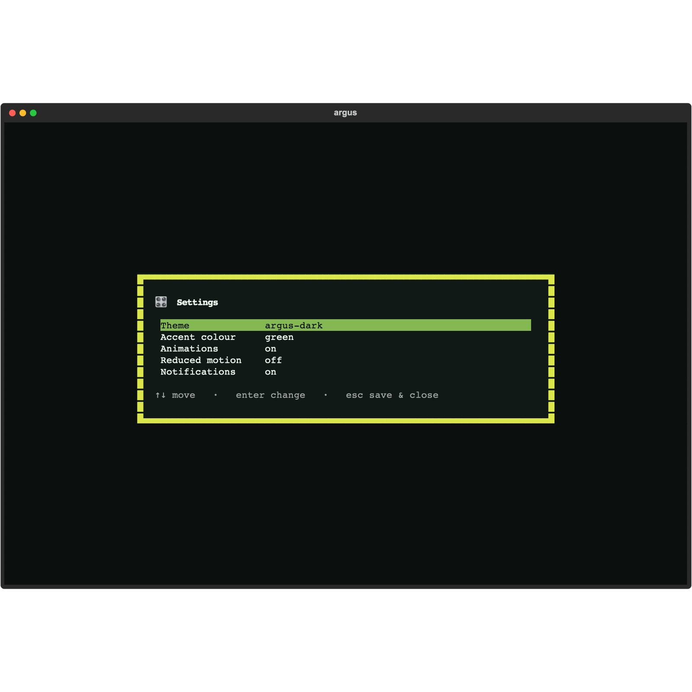
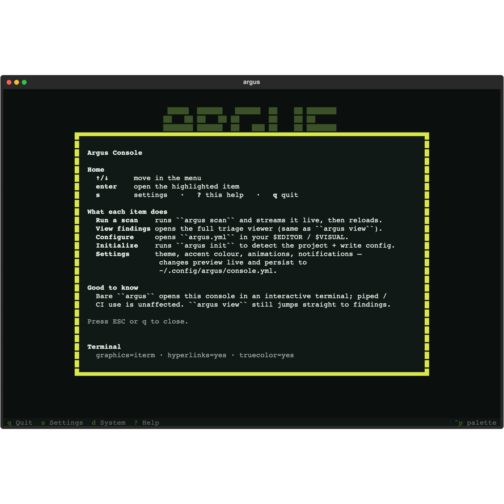

# Argus Enterprise

Argus is free and open source (AGPL-3.0) — the SDK, scanners, CLI, and the
interactive viewers are yours to run anywhere, forever. **Argus Enterprise** is a
commercially-licensed layer on top, built and supported by **Huntridge Labs**,
for teams that want a richer local experience and board-ready reporting.

It installs *alongside* open-source Argus and only ever **adds** — your existing
`argus scan` and `argus view` workflows are unchanged, and nothing is taken away
from the open-source edition.

> **Want these features?** [Talk to Huntridge Labs →](https://www.huntridgelabs.com/)

---

## The Argus Console

Run `argus` and land in a full-screen **home Console** — a single cockpit for the
whole local workflow instead of remembering subcommands.

- **Run a scan** and watch it stream live, then drop straight into the results.
- **Browse findings** in the interactive triage viewer.
- **Configure `argus.yml`** through a guided form editor — toggle scanners and
  settings without hand-editing YAML.
- **Initialize** a project: detect languages, frameworks, and infrastructure,
  then generate a tailored config.
- A live **system-readiness check** (Docker, local tools, image freshness) and a
  **`Ctrl+P` command palette** to jump anywhere.

**Make it yours.** Live-previewed theming, accent colours, animations, and
notification preferences — persisted across sessions.

Built-in help and keybindings are always a keystroke away.

---

## One-click PDF reports

Turn a scan into a polished, paginated **vulnerability report PDF** — server-side,
in a single click from the web viewer. Consistent output everywhere (no browser
print dialogs), commit-stamped for the record, and ready for audits, customers,
and the boardroom.

The open-source web viewer already renders an HTML report you can print from your
browser; Enterprise adds the one-click, server-rendered PDF.

---

## How it fits with open-source Argus

| | Open source (AGPL-3.0) | Argus Enterprise |
|---|---|---|
| `argus scan` — all scanners & linters | ✅ | ✅ |
| `argus view terminal` / `browser` viewers | ✅ | ✅ |
| HTML report (print-to-PDF from your browser) | ✅ | ✅ |
| **Argus Console** (the `argus` home cockpit) | — | ✅ |
| **One-click server-side PDF reports** | — | ✅ |
| Priority support & SLAs | — | ✅ |

Enterprise is a clean add-on: install it next to open-source Argus and the new
capabilities light up; remove it and you still have a fully working open-source
Argus.

---

## Get Argus Enterprise

Licensing, deployment (including air-gapped / on-prem), and pricing are tailored
per team — including GitHub Enterprise Server and FedRAMP environments.

**[Contact Huntridge Labs to learn more →](https://www.huntridgelabs.com/)**
