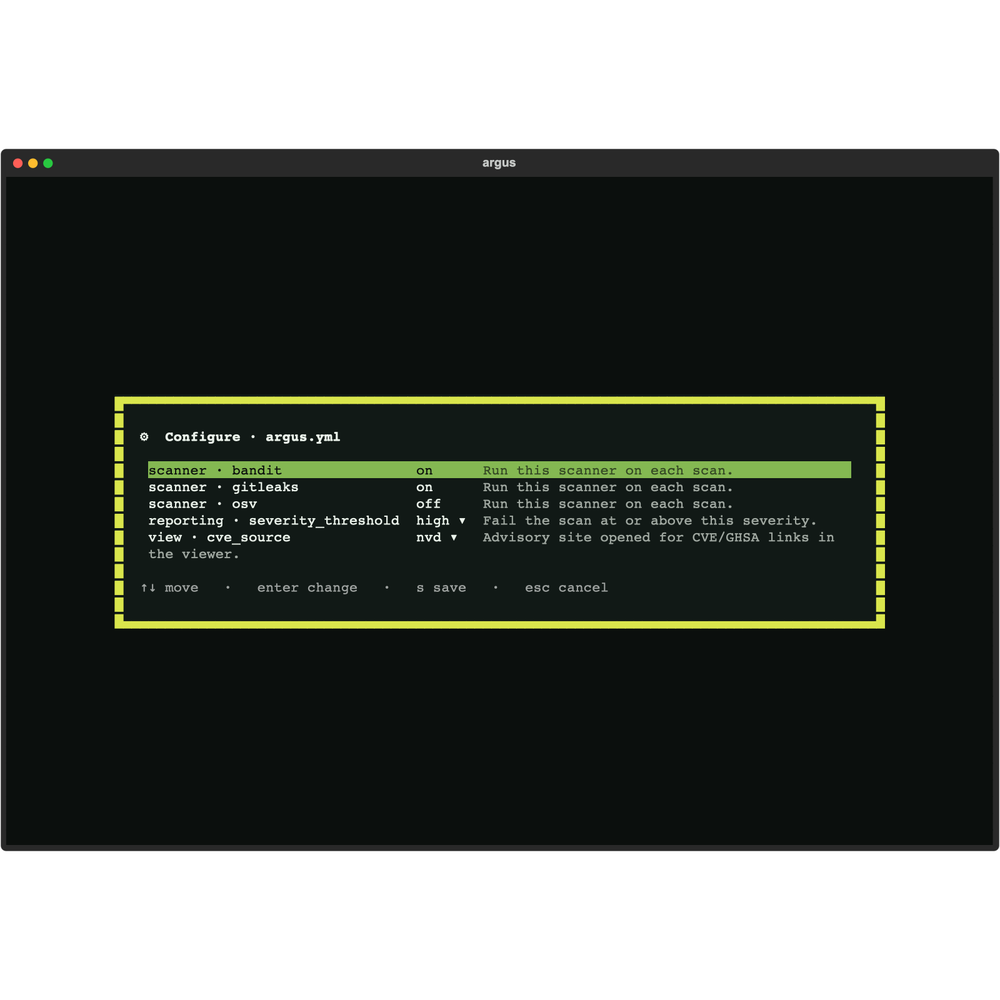
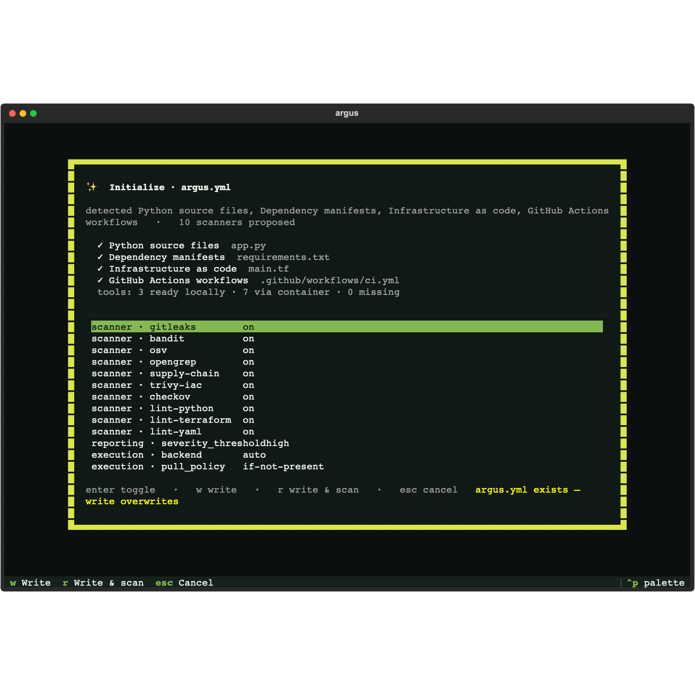
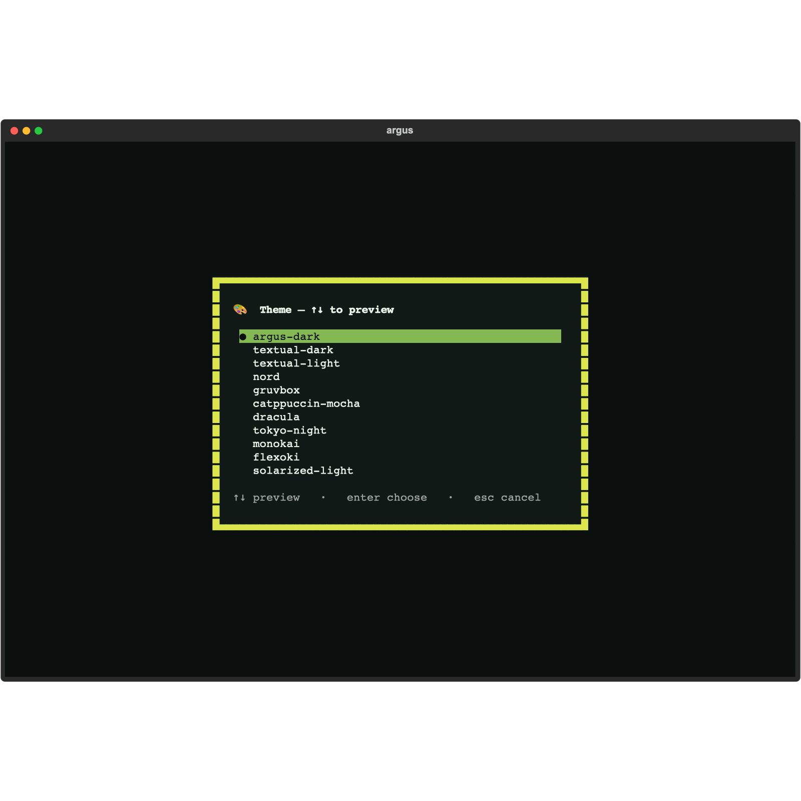
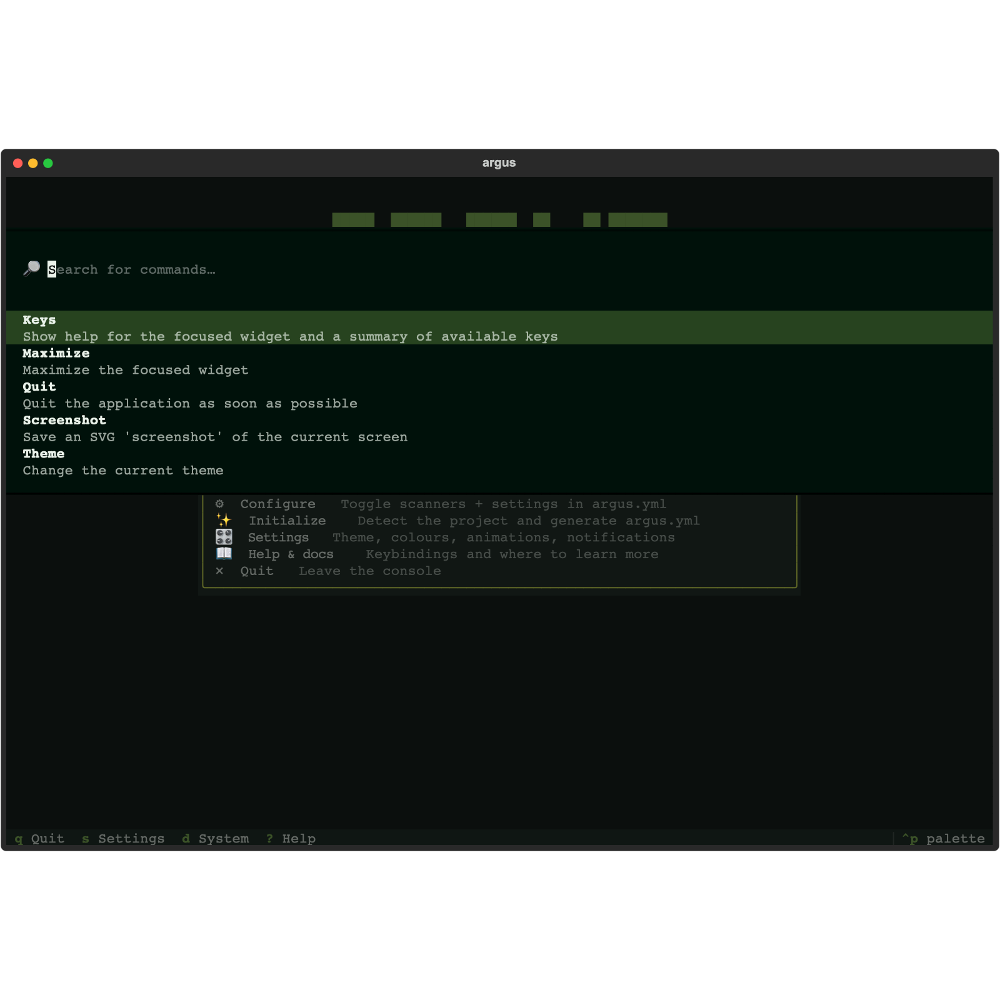
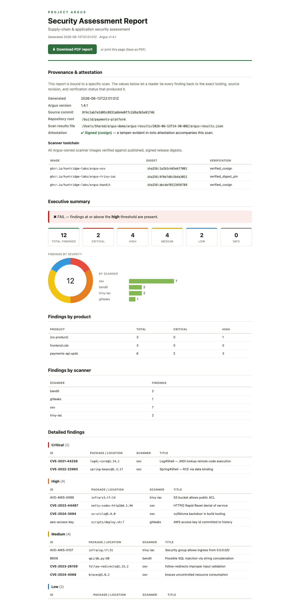

# Argus Enterprise

Argus is free and open source (AGPL-3.0) — the SDK, scanners, CLI, and the
interactive viewers are yours to run anywhere, forever. **Argus Enterprise** is a
commercially-licensed layer on top, built and supported by **Huntridge Labs**,
for teams that want a richer local experience and board-ready reporting.

It installs *alongside* open-source Argus and only ever **adds** — your existing
`argus scan` and `argus view` workflows are unchanged, and nothing is taken away
from the open-source edition.

> **Want these features?** [Talk to Huntridge Labs →](https://www.huntridgelabs.com/)

---

## The Argus Console

Run `argus` and land in a full-screen **home Console** — one cockpit for the
whole local workflow, instead of remembering subcommands. Scan, triage,
configure, and initialize from a single keyboard-driven hub with a live
system-readiness check.

### Configure `argus.yml` without touching YAML

A guided form editor: toggle scanners on and off and change settings with
arrow keys and Enter — comment-preserving, schema-validated, no hand-editing.

### Initialize a project in seconds

Detect languages, frameworks, dependency manifests, IaC, and CI workflows — then
propose a tailored scanner set and a ready-to-write `argus.yml`, with a live
tool-readiness summary.

### Make it yours

Live-previewed theming and preferences — arrow through themes and watch the UI
recolour instantly; tune accent, animations, reduced-motion, and notifications,
all persisted across sessions.

### Jump anywhere

A `Ctrl+P` command palette for fuzzy jump-to-action, plus built-in help and a
full keybinding reference a keystroke away.

---

## Board-ready PDF reports

Turn a scan into a polished, paginated **vulnerability report PDF** — server-side,
in a single click from the web viewer. An executive summary, severity breakdown,
findings by product and scanner, full detail tables, and a **provenance &
attestation** section binding findings to the exact commit and cosign-verified
scanner image digests that produced them. Consistent output everywhere (no browser
print dialogs), commit-stamped, and ready for auditors, customers, and the board.

The open-source web viewer already renders an HTML report you can print from your
browser; Enterprise adds the one-click, server-rendered PDF.

---

## How it fits with open-source Argus

| | Open source (AGPL-3.0) | Argus Enterprise |
|---|---|---|
| `argus scan` — all scanners & linters | ✅ | ✅ |
| `argus view terminal` / `browser` viewers | ✅ | ✅ |
| HTML report (print-to-PDF from your browser) | ✅ | ✅ |
| **Argus Console** (the `argus` home cockpit) | — | ✅ |
| **One-click server-side PDF reports** | — | ✅ |
| Priority support & SLAs | — | ✅ |

Enterprise is a clean add-on: install it next to open-source Argus and the new
capabilities light up; remove it and you still have a fully working open-source
Argus.

---

## Get Argus Enterprise

Licensing, deployment (including air-gapped / on-prem), and pricing are tailored
per team — including GitHub Enterprise Server and FedRAMP environments.

**[Contact Huntridge Labs to learn more →](https://www.huntridgelabs.com/)**
