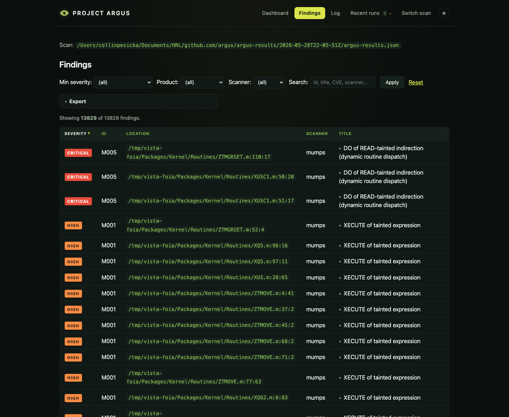

# `argus view browser` — local read-only web UI

After a scan produces `argus-results.json`, there are three ways to look at
it today: open the JSON directly (for engineers comfortable with the shape),
run [`argus view terminal`](view-terminal.md) (for engineers who live in the terminal), or
`argus view browser` — a tiny web app bundled with the SDK that serves the same
findings to anyone with a browser.

Aimed at owners, managers, and executives who want at-a-glance insight
into their product's security posture without digging through CI logs or
learning a TUI.

## Install

```bash
pip install 'argus-security[browser]'
```

Pulls in FastAPI, uvicorn, Jinja2, and python-multipart (~10 MB total).
Without the extra, running `argus view browser` prints a friendly install hint and
exits cleanly — the extra is never required for `argus scan` or any other
subcommand.

## Launch

```bash
argus view browser                          # picker rooted at CWD
argus view browser /path/to/results/        # load that scan directly
argus view browser /path/to/scans-parent/   # picker rooted there
argus view browser --port 9090              # non-default port
argus view browser --no-open                # skip auto-opening the browser (default opens it on TTY)
```

**Localhost only.** The server always binds to `127.0.0.1` — there is no
`--bind` flag by design. Single-user, single-machine is the product shape;
it's what makes "no auth, no sessions, no CSRF handling" the right scope.
For multi-user enterprise deployments, see the separate
[`argus-portal`](https://github.com/huntridge-labs/argus-portal) track.

## Views

### `/` — Executive summary dashboard

Opens here by default.


Shows:

- **Total findings** + per-severity breakdown (cards at the top, each a
  deep-link into the matching `/findings` filter)
- **Visual analytics** — a **severity donut**, a **findings-over-time** trend
  line (from the run history), and a **by-scanner** bar chart. Rendered as
  inline SVG with no chart-library dependency; the line draws on and the
  cards count up on load (motion is gated on `prefers-reduced-motion`)
- **Scan quality warnings** — SPDX-2.1 SBOMs Trivy can't read, low-purl
  coverage, Grype "couldn't identify scan subject" — surfaced loudly so
  empty scans aren't misread as clean
- **Per product** — every SBOM source with total + critical + high counts
  and the top-3 findings (severity, ID, package, title)
- **Per scanner** — contribution counts (useful for spotting when one
  scanner did 90% of the work, which often signals an input format issue)

> **Motion & polish.** The viewer uses a dependency-free motion layer — the
> CSS [View Transitions API](https://developer.mozilla.org/docs/Web/API/View_Transitions_API)
> cross-fades page navigations, cards/charts rise in on load, and the trend
> line draws on. All of it is wrapped in `prefers-reduced-motion`, so the UI
> degrades to a fully static, accessible page (the screenshots above are
> captured in exactly that reduced-motion state).

### `/findings` — Filterable table



The spreadsheet view. Dropdown filters for severity, product, and scanner;
a search box that matches id, title, location, CVE, and scanner name. Filters
combine with AND semantics — the exact same logic the TUI uses.

URLs are bookmarkable:
```
http://localhost:8080/findings?scan=/path/to/results&min_severity=high&product=BVMS.spdx
```

JS-enhanced sessions get live filter updates without a page reload; non-JS
clients see the same content via a plain form submit (Apply button is the
fallback).

### `/picker` — Switch scan

A one-level file browser. Click into subdirectories; any directory containing
an `argus-results.json` gets a "Load scan" button with a finding-count peek.
Dotfiles and common build directories (`node_modules`, `.git`, `.venv`, etc.)
are hidden by default; `?show_hidden=1` reveals them.

Deliberately non-recursive — users drive the navigation. That keeps the
picker fast (no filesystem walk on every request) and avoids decisions about
depth limits and gitignore semantics.

### `/healthz`

Liveness check. Returns `{"status": "ok", "root": "<picker-root>"}`. Handy
for scripts that need to know when the server has started up.

## Security posture

- **CSP header on every response**: `default-src 'self'; style-src 'self'
  'unsafe-inline'; script-src 'self'`. Blocks inline scripts and any
  cross-origin resources.
- **`X-Frame-Options: DENY`** — the dashboard can't be framed into a
  parent page (harmless in the localhost-only context, defensive against
  future non-localhost deployments).
- **Jinja2 autoescape** — scanner-supplied text (finding titles, descriptions)
  is HTML-escaped before reaching the page. Combined with the CSP, an
  attacker-controlled CVE description can't execute script in the browser.
- **No auth, no cookies, no sessions** — localhost-only means single user;
  there's nothing for a session to represent.
- **No mutations** — every route is `GET`. Nothing on the server to
  defend against CSRF.
- **Input sanitization** — filter values passed via URL are validated; bogus
  `min_severity=??` falls back to "no filter" instead of crashing the route.

## Not in v1 (tracked as future roadmap items)

- **Live reload** when `argus-results.json` changes on disk. Right now:
  browser refresh to re-read the file.
- **Scan-over-scan diff** — compare today's scan to last week's.
- **JSON API endpoints** — external tools (Slack bots, custom dashboards)
  can read `argus-results.json` directly today; we'll add `/api/...` if a
  real use case shows up.
- **Recursive picker walks** — one directory level at a time is the current
  design. If users ask for "find all scans under this tree," that's a
  separate UX decision (performance, gitignore semantics, skip-rules).

## Architecture relationship to `argus view terminal` and `argus-portal`

Three UIs look at the same data; each has its own scope:

| Tool | Scope | Audience |
|------|-------|----------|
| `argus view terminal` (TUI) | Single scan, read-only | Engineer triaging in a terminal |
| `argus view browser` (this) | Single scan, read-only, local web | Owner / manager / exec on the same machine |
| `argus-portal` | Multi-scan, multi-user, persistent DB, OAuth, FedRAMP | Enterprise compliance organization |

**`argus view terminal` and `argus view browser` share a module** — `argus.core.findings_view`
— that owns the filter / sort / summary logic. ViewState semantics,
compute_summary output, and severity ordering are identical across the TUI
and the web view. A filter that produces 17 results in the TUI produces the
same 17 in the browser.

`argus-portal` is a separate project on a separate track. It doesn't share
code today; when it matures, we may factor a third consumer onto
`findings_view` so all three agree on what "high severity" means and which
findings match which filter.

## Troubleshooting

**`argus: error: argument command: invalid choice: 'serve'`** — your `argus`
binary was installed before `serve` landed. Reinstall: `pip install --upgrade
--pre 'argus-security[browser]'`.

**"The local web UI needs the 'serve' extra"** — you installed `argus-security`
but not the `[serve]` extra. Retry with `pip install 'argus-security[browser]'`.

**Port 8080 already in use** — pass `--port 9090` (or any free port).

**Browser didn't auto-open** — we use the stdlib `webbrowser`
module which is generally reliable but can fail silently in headless or
SSH-remoted environments. The URL is printed to stdout — open it manually.

**Page renders "No scan loaded"** — the directory you pointed `argus view browser`
at doesn't contain an `argus-results.json`. Use `/picker` to navigate to one,
or pass `?scan=/abs/path` on `/`.

## Related

- [`argus scan`](cli-reference.md#argus-scan) — produces the
  `argus-results.json` this UI reads.
- [`argus scan --interface=terminal`](view-terminal.md) — launches the TUI after a scan.
- [`argus view terminal`](view-terminal.md) — keyboard-driven TUI for the same data.
- [SDK roadmap](developer/SDK-ROADMAP.md) — the migration record and any
  surviving follow-ups.
