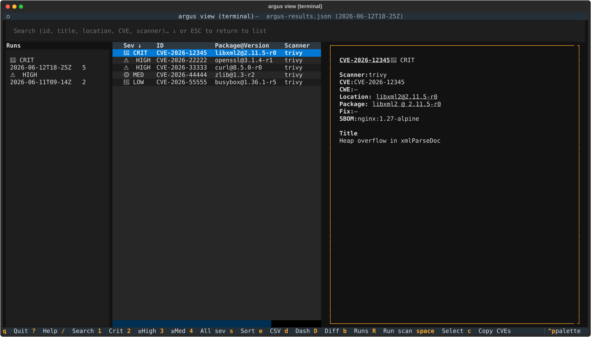
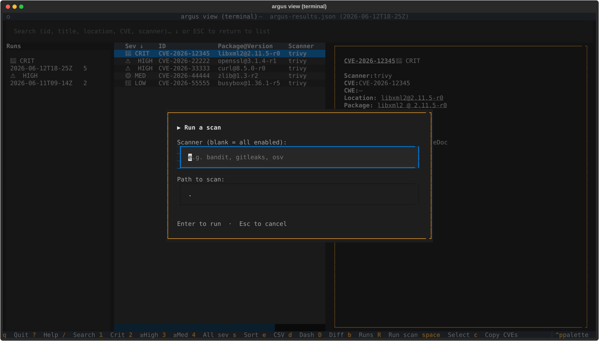
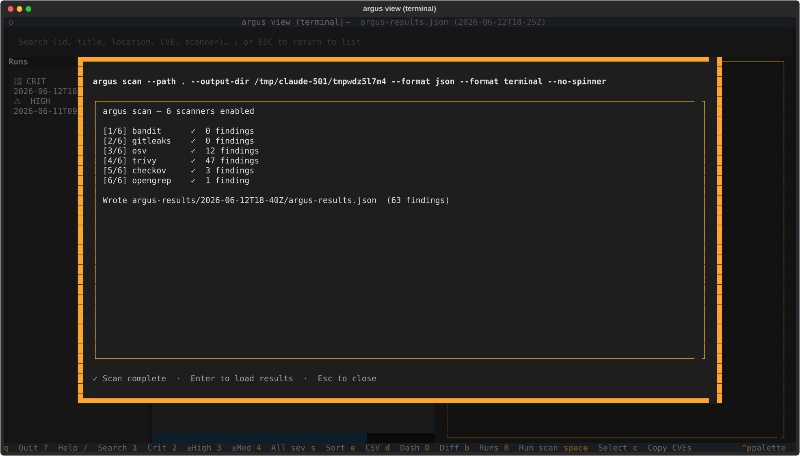
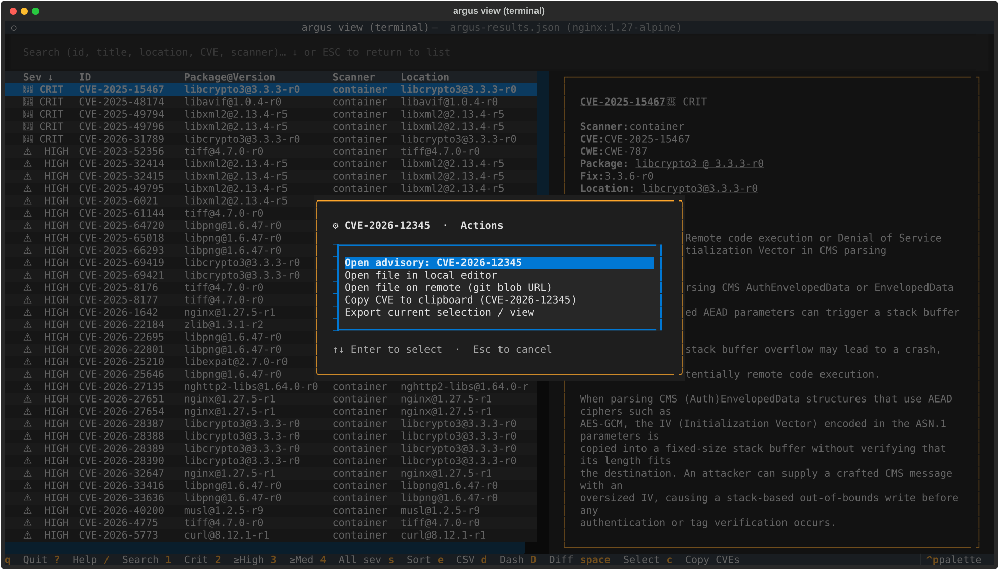
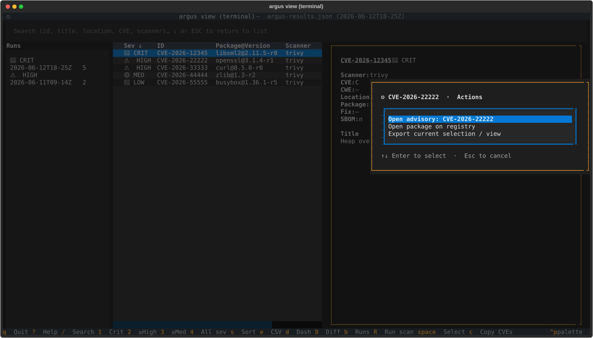
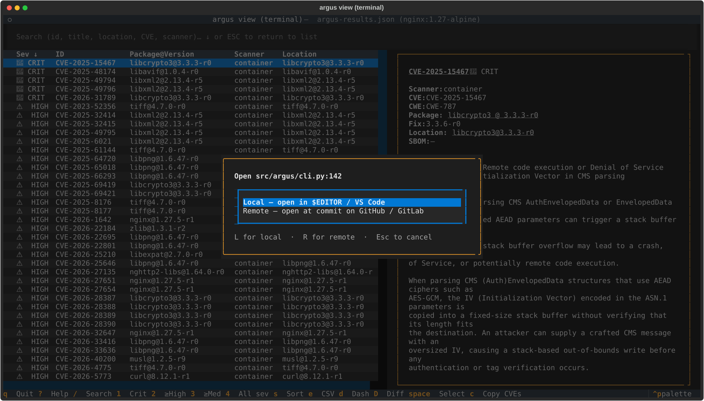

# `argus view terminal` — interactive findings triage

After a scan produces `argus-results.json`, reading the raw file in an editor
or paging through the linear Markdown report is a poor way to triage.
`argus view terminal` is a full-screen terminal UI for *navigating* findings: filter by severity,
product, or scanner; search by CVE; drill into details; export the filtered
subset; see an executive summary — all with keyboard shortcuts.

Ships behind an optional extra so CI/server installs of argus stay
lightweight.

## Install

```bash
pip install 'argus-security[terminal]'
```

The extra pulls in [Textual](https://textual.textualize.io/) (~2 MB of Python
deps). Without it, running `argus view terminal` prints a friendly install hint and
exits cleanly — the extra is never required for `argus scan` or any other
subcommand.

## Launch

```bash
argus view terminal                          # loads ./argus-results/argus-results.json
argus view terminal ./run-2026-04-24         # specific results directory
argus view terminal ./custom-results.json    # direct file path
```

### One-flag scan → browse workflow

```bash
argus scan --interface=terminal              # scans, then opens the terminal viewer on the output
argus scan --sbom data/ --interface=terminal # batch-scan a directory of SBOMs, then browse
```

The `--interface=terminal` flag takes effect after the scan completes and the
manifest is finalized. If the `[terminal]` extra isn't installed, the scan
still succeeds; only the viewer launch is skipped with a note.

## Keyboard reference

Press `?` inside the TUI for the same reference, grouped by purpose.

| Key | Action |
|-----|--------|
| **Navigate** | |
| `j` / `k` or `↑` / `↓` | move selection |
| `tab` | jump between panes |
| **Search & filter** | |
| `/` | focus search (matches id, title, location, CVE, scanner) |
| `ESC` | exit search back to the findings list |
| `1` | show only CRITICAL findings |
| `2` | HIGH severity and above |
| `3` | MEDIUM severity and above |
| `4` | clear severity filter (all) |
| `p` | pick a product (SBOM source) to focus on — modal |
| `N` (shift+n) | pick a scanner to focus on — modal |
| **Multi-select (batch actions)** | |
| `space` | toggle selection on the focused row |
| `a` | select every row in the current filter (additive) |
| `A` (shift+a) | clear all selections |
| `c` | copy selected findings' CVE IDs to the clipboard |
| **Sort** | |
| `s` | cycle: severity desc → asc → package → id (toast + header arrow) |
| **Export** | |
| `e` | export visible findings (or selection) as CSV |
| `o` | open last export with your default app |
| `r` | reveal last export in file manager |
| **Runs & scanning** | |
| `b` | toggle the runs sidebar — switch between scan runs without relaunching |
| `R` (shift+r) | run `argus scan` in-app, stream output, and reload results when done |
| `F` (shift+f) | fix — propose a dependency bump for the finding (or selection), preview the diff, apply |
| `i` | enrich — fetch EPSS + CISA KEV intelligence for the CVEs in view (see below) |
| `S` (shift+s) | triage — suppress / accept-risk the finding (or selection), writing OpenVEX + ignore files (see below) |
| `x` | explain — ask a local (Ollama) or cloud model to explain the focused finding (see below) |
| **Other** | |
| `d` | executive dashboard overlay |
| `D` (shift+d) | scan-over-scan diff — pick another `argus-results.json` and bucket changes |
| `?` | help overlay |
| `Ctrl+P` | command palette (fuzzy-search every action) |
| `q` | quit |

JSON, Markdown, and SARIF exports are available via `Ctrl+P` → type
`Export: JSON` / `Export: Markdown` / `Export: SARIF`. The filename
convention is `argus-findings-YYYYMMDD-HHMMSS-<severity>.<ext>` so repeated
exports at different filters never clobber each other.

## Runs sidebar & in-app scanning

The terminal viewer isn't limited to the single run you launched it on.

**Switch between runs (`b`).** Press `b` to reveal the runs sidebar — a
list of every scan run found next to the current one, newest first, each
row tagged with the glyph of its worst finding and its finding count. It
auto-reveals when more than one run is present. Click a run (or select it
with the arrow keys and `Enter`) to load it in place; your active
severity / product / scanner / search filters carry over so you can watch
the same slice move across scans. Run discovery is the same logic the
browser interface uses for its picker and "recent runs" dropdown, so both
agree on what counts as a run (including collapsing the `latest/` symlink
into the timestamped run it points at).



**Run a scan (`R`).** Press `R` (shift+r) to launch `argus scan` without
leaving the TUI. A prompt collects an optional scanner (blank runs all
enabled scanners from your `argus.yml`) and a path; the scan then streams
its output into an overlay. When it finishes successfully the new run is
loaded automatically and appears at the top of the runs sidebar. The scan
runs the same interpreter the TUI is running under (`sys.executable -m
argus`), so a viewer launched from a virtualenv scans with that venv's
argus and scanners.





## Fixing findings (`F`)

Press `F` (shift+f) to apply a **deterministic, OSS, no-AI** fix to the
focused finding — or to every fixable row in the multi-select set. This
first tier covers the highest-volume case: **dependency version bumps**.
For a dependency finding with a known fixed version, Argus locates the
package in your manifest (`requirements*.txt` for pip, `package.json` for
npm) and proposes a unified diff that bumps it to the fixed version,
preserving your existing version-spec style (a pinned `==` stays pinned; a
`>=` range keeps its operator). When no manifest line matches, it falls
back to showing the ecosystem's upgrade command instead.

It's **diff-first**: the proposed change is previewed and nothing touches
your working tree until you press `a` / Enter to apply. After applying,
re-run the scan (`R`) to confirm the finding is resolved. Findings that
can be fixed also get an `⚒ Apply fix` entry in the right-click context
menu. Findings with no known fixed version (or in an ecosystem Tier 1
doesn't cover yet) report that no automatic fix is available.

## Live vulnerability intelligence (`i`)

A CVE id and a severity label don't answer the question that actually
matters: *should I care about this one, right now?* Press `i` to enrich the
CVEs in view with two free, no-auth signals that do:

- **EPSS** (FIRST.org) — the **exploit-probability** score: how likely the
  CVE is to be exploited in the next 30 days.
- **CISA KEV** — whether the CVE is in the **Known-Exploited-Vulnerabilities**
  catalog, i.e. *actively* exploited in the wild.

The selected finding's detail pane then shows an **EPSS** percentage, a
**KEV** flag, and a blended **Risk** score (severity-weighted, EPSS-modulated,
floored high for KEV entries) — so a HIGH that's actively exploited rises
above a CRITICAL that isn't. A toast summarises the batch (how many CVEs, how
many in KEV, the top EPSS), and the header gains a `🔥KEV` / `EPSS n%` badge.

Enrichment is **opt-in and offline-degrading**: it only reaches the network
when you press `i`, runs off the UI thread so nothing blocks, caches results
on disk (`$XDG_CACHE_HOME/argus/`) so repeat triage is offline, and sends
only public CVE ids — never your source or secrets. With no network (or
`ARGUS_NO_NETWORK=1`) the viewer behaves exactly as before, just without the
badges.

### Reachability

For dependency findings, the detail pane also shows a **Reachability** row —
a first-cut heuristic answering *is the vulnerable package even imported in
this project's source?* A declared-but-never-imported dependency
(`not imported (likely unused)`) is a strong "lower real risk" signal; one
that's `imported in source` is clearly in play. It's a bounded, dependency-
free source scan (pip / npm import patterns, build & vendor dirs skipped),
cached per package. Deliberately labelled "imported in source," **not**
"reachable" — true call-graph reachability is a harder, ecosystem-specific
problem tracked as research in the roadmap, not claimed here.

## Triage & suppression (`S`)

Triage at scale, the way security teams actually do it — but with a durable
audit trail instead of a spreadsheet. Multi-select findings (`space` / `a`)
or focus a single one, press `S` (shift+s), pick a **status**, and type a
**reason**:

| Status | OpenVEX mapping |
|---|---|
| False positive | `not_affected` · justification `vulnerable_code_not_present` |
| Not exploitable | `not_affected` · justification `vulnerable_code_not_in_execute_path` |
| Accept risk | `affected` · your reason recorded as the `action_statement` |
| Under investigation | `under_investigation` |

Argus writes the decision to two places:

- **`argus-results.openvex.json`** — an OpenVEX document (the audit trail:
  per-CVE status, justification, your reason, author, timestamp). Re-triaging
  the same finding *updates* its statement and bumps the document version
  rather than duplicating it; an existing VEX file is merged, not clobbered.
- **`.trivyignore` / `.gitleaksignore`** — so the *next scan* honours the
  decision. CVE findings append to `.trivyignore` (with your reason as a
  comment); secret findings append their fingerprint to `.gitleaksignore`.
  `Under investigation` records a VEX statement but writes no ignore entry.

This reuses the same OpenVEX vocabulary as Argus's signed scan attestations,
so a TUI triage decision and a CI-generated VEX speak the same language.

## AI explanation (`x`)

Press `x` to ask a model to explain the focused finding — what it is, why it
matters *here*, and the likely real-world impact, with the Phase-6 exploit
intelligence (EPSS / KEV) folded into the prompt when present.

**Local-first and opt-in — no API key required to use Argus.** AI is off by
default. Two ways to turn it on:

- **Local model (recommended):** `export ARGUS_AI_LOCAL=1` to use a local
  [Ollama](https://ollama.com) endpoint (or set `OLLAMA_HOST`). Nothing
  leaves your machine.
- **Cloud model:** `export ARGUS_AI_PROVIDER=anthropic` (or `openai`) plus
  the provider's API key (`ANTHROPIC_API_KEY` / `OPENAI_API_KEY`). Override
  the model with `ARGUS_AI_MODEL`.

With neither configured, `x` shows a hint and does nothing else — no silent
network calls. Model output is **advisory**: it's there to speed up triage,
not to be trusted blindly, and any AI-suggested *fix* would still go through
the same diff-preview gate as the deterministic `F` fix (never auto-applied).
This reuses the provider abstraction already behind `argus classify`, so
there's one AI integration across the tool.

## Mouse interactions

Every visible piece of state in the TUI is a click target. Keyboard
bindings keep working in parallel — these are additive, not a
replacement.

| Surface | Mouse action | What it does |
|---|---|---|
| Findings table — row | hover | Subtle highlight on the row under the cursor |
| Findings table — row | left-click | Move the cursor + update the detail pane |
| Findings table — row | second left-click on focused row, **or** right-click | Open the context menu for that finding |
| Findings table — column header | left-click | Cycle sort (same modes as `s`) |
| Detail pane — CVE / GHSA ID | left-click | Open the upstream advisory page in your default browser |
| Detail pane — `file:line` value | left-click | Open the file at that line (mode controlled by `view.open_location` — see below) |
| Detail pane — `package@version` value | left-click | Open the package's PyPI or npm registry page |
| Status bar — severity chip | left-click | Clear the severity filter (back to "all") |
| Status bar — product / scanner / query chip | left-click | Clear that one filter |
| Status bar — sort chip | left-click | Cycle sort modes (same as `s`) |
| Footer — keybind hint | left-click | Run the same action the key would |

### Context menu actions

The right-click / second-click menu opens at the cursor (clamped to stay
on screen near an edge) and lists only the actions that apply to the
focused finding (no "open file" entry for a Bandit finding that has no
location, etc.):

- **Open advisory** — opens the CVE or GHSA in your browser
- **Open file in local editor** — shells out to `$VISUAL` / `$EDITOR`
  / VS Code (`code -g file:line`) / fallback to `xdg-open` / `open`
- **Open file on remote (git blob URL)** — opens the file at the
  scan's commit SHA on the repo's `origin` remote (GitHub, GitLab,
  or self-hosted of either)
- **Open package on registry** — PyPI for plain names, npm for
  scoped (`@scope/pkg`) shapes
- **Copy CVE to clipboard** — only shown for CVE-bearing findings
- **Export current selection / view** — same path as the `e` key



The menu opens at the click position rather than screen-centre (clamped so it never spills off an edge):



When `view.open_location: ask` (the default), clicking a `file:line`
value pops a tiny "local or remote?" prompt so you can pick per click
without setting a config preference up front:



### Configuration (`argus.yml` → `view:`)

Defaults are tuned for a developer workstation with Git, a browser,
and an editor available. The three knobs:

```yaml
view:
  cve_source: nvd          # nvd | cve_org | github | mitre
  open_location: ask       # ask | local | remote
  editor: ""               # override $EDITOR (e.g. "code -g", "nvim", "subl -w")
```

- `cve_source` — where clicked CVE IDs land. Default `nvd`
  (`nvd.nist.gov/vuln/detail/<CVE>`). GHSA IDs always route to
  `github.com/advisories/<GHSA>` regardless of this setting.
- `open_location` — how clicked `file:line` cells resolve. Default
  `ask` pops a tiny modal letting you pick local or remote per
  click. `local` always shells out to your editor. `remote` always
  constructs a git blob URL at the scan's recorded commit SHA.
- `editor` — explicit editor command. When unset, falls through to
  `$VISUAL` → `$EDITOR` → VS Code on PATH → `xdg-open` / `open`.
  VS Code's `code -g file:line` goto-line form is special-cased; vim
  / nvim / emacs / nano use `+<line> <file>`.

## Views

### Findings list (default)

Two-pane layout: table of findings on the left, detail of the currently
highlighted row on the right. The status bar lists every active filter
(severity, product, scanner, query) plus the current sort mode.


Press `3` to drop to medium-and-above only — useful when triage hurts:


`1` narrows further to criticals only, the natural starting point on a
fresh scan:


### Executive dashboard (`d`)

Modal overlay aimed at owners / managers / execs who want a one-screen
answer to "what's the state of our security posture?":

- Total findings with per-severity breakdown (Critical / High / Medium /
  Low / **Info** — Info covers attack-surface signal like declared
  EXPOSE ports and enumerated services, not just CVEs)
- Quality warnings — SPDX-2.1 SBOMs Trivy can't read, SBOMs missing purl
  refs, Grype's "couldn't identify scan subject" warnings — surfaced loudly
  so an empty scan isn't misread as "we're clean"
- **Visual analytics** — a *findings-over-time* sparkline with a "↑/↓ vs
  previous run" delta (drawn from the same run history the runs sidebar
  uses), plus **by-severity** and **by-scanner** bar charts. Rendered with
  Unicode block characters, so they need no extra dependency and work in any
  terminal — fitting for a supply-chain tool that minimises its own surface.
- Per-product breakdown — every SBOM source with total + crit + high counts
  and the top-3 findings
- Per-scanner contribution counts


Dismiss with `ESC`, `q`, or `d` again.

### Scan-over-scan diff (`D` — shift+d)

Modal overlay for the most common follow-up question after "what's
there now?": *what changed since the last run?*

`D` opens a small picker where you type or paste a path to another
`argus-results.json` (or its containing run directory). On submit the
TUI loads the second scan and renders four buckets, with counts at the
top:

| Bucket | Meaning |
|--------|---------|
| **New** | finding present in the current scan only — fresh issue introduced since the comparison |
| **Fixed** | finding present in the comparison only — resolved between runs |
| **Severity changed** | same `(scanner, id, location)` identity tuple in both, but the severity rating shifted (e.g. CVE re-scored MEDIUM → HIGH) |
| **Still open** | identity tuple matches AND severity unchanged — finding persists |

Identity is the `(scanner, id, location)` tuple — bucketing logic
lives in `argus.core.findings_view.diff_scans` and is shared with the
browser interface's `/diff` route, so both surfaces stay aligned.


Dismiss with `ESC`, `q`, or `D` again. The browser interface
(`argus view browser` → `/diff`) renders the same buckets if you'd
prefer a wider canvas with clickable rows.

### Help overlay (`?`)

Grouped keyboard reference with a one-line explanation of each binding.
Dismiss with `ESC`, `q`, or `?` again.


### Pickers — Product (`p`) / Scanner (`shift+n`)

Filter the table to a single product (per-SBOM source) or a single
scanner. The picker lists every value present in the current results
with its row count; selection updates the status bar and the table in
one keystroke. `Esc` dismisses without applying.


### Command palette (`Ctrl+P`)

Textual's built-in fuzzy-search launcher. Every `argus view terminal` action is
registered as a command — type "sort", "filter", "export", "dashboard",
"product", etc. to find them. Textual's own commands (Keys help, Theme
switcher, Screenshot-as-SVG) also appear.

The **Screenshot** command is genuinely useful: saves the current TUI view
as an SVG you can drop into a ticket or doc — better than cropping a
terminal screenshot manually.

## Multi-select for batch actions

Triage workflows often want to act on a subset of findings — export N
rows as CSV for a spreadsheet, or paste a list of CVE IDs into a
bug-tracker comment. The TUI keeps a per-session selection set you can
build with `space` / `a` / `A`:

| Key | Action |
|-----|--------|
| `space` | toggle selection on the focused row (adds a `✓` glyph in the leading column) |
| `a` | select every visible row (additive — preserves any cross-filter picks) |
| `A` (shift+a) | clear every selection |
| `c` | copy selected findings' CVE IDs to the clipboard, one per line |

The status bar shows `<N> selected` whenever the selection is
non-empty. Selection survives filter changes — a row that gets
filtered out and back retains its mark.

### How `e` and `c` use the selection

- **`e` (Export)** — when the selection is non-empty, the export
  writes only the selected rows; the filename's scope marker is
  `selection`. With nothing selected, `e` keeps its original behavior
  (writes the entire filtered view).
- **`c` (Copy CVEs)** — copies the CVE IDs of the selected rows.
  Findings without a CVE (SAST, secret-scanner) fall back to
  `<scanner>:<id>` so each line is still identifiable. Order is
  visible-rows-first, then any cross-filter selections, so the paste
  reflects what you saw on screen.

### Clipboard fallback chain

The TUI tries each mechanism in order until one succeeds, then names
the winner in the toast:

| Platform | Order |
|----------|-------|
| Any | `pyperclip` (when installed) |
| macOS | → `pbcopy` |
| Linux | → `xclip -selection clipboard`, then `wl-copy` (Wayland) |
| Windows | → `clip` |

If nothing works (e.g. headless Linux without `xclip`/`wl-copy`),
the TUI shows a graceful "no clipboard mechanism available" toast
rather than crashing — install `pyperclip` (`pip install pyperclip`)
or your distro's clipboard CLI to enable it.

## Export formats

All four writers take the currently filtered view. Pick via keyboard shortcut
(`e` for CSV) or the command palette for the others.

| Format | Best for | Produces |
|--------|----------|----------|
| **CSV** | Spreadsheet work, bulk ticket upload | `argus-findings-<stamp>-<scope>.csv` |
| **JSON** | Scripting, downstream automation | `argus-findings-<stamp>-<scope>.json` — list of `Finding.to_dict()` objects, identical shape to `argus-results.json` per-finding records |
| **Markdown** | Ticket bodies, PR descriptions | `argus-findings-<stamp>-<scope>.md` — table with severity icons, pipe-escaped cells |
| **SARIF** | Security dashboards, GitHub Code Security | `argus-findings-<stamp>-<scope>.sarif` — SARIF 2.1.0, per-scanner runs, severity→level mapping |

Exports write to the current working directory. `.gitignore` patterns
(`*.csv` and `argus-findings-*.{json,md,sarif}`) cover them in the argus
repo; add similar rules to downstream projects where you run `argus view terminal`.

## Platform notes

- **macOS**: `o` opens with the file's default app (Numbers for `.csv`,
  your Markdown viewer for `.md`); `r` reveals in Finder via `open -R`.
- **Windows**: `o` uses `cmd /c start`; `r` uses `explorer /select,<path>`
  (highlights the file in Explorer).
- **Linux**: `o` uses `xdg-open`; `r` opens the parent directory via
  `xdg-open` — there is no portable "select file" verb across file managers.

All opener invocations go through `subprocess.Popen` with an argv list, not a
shell string, so paths with spaces, quotes, or special characters are safe.

## Troubleshooting

**`argus: error: argument command: invalid choice: 'browse'`** — your `argus`
binary was installed before `browse` landed. Reinstall: `pip install -e
'.[browse]'` in a dev checkout, or `pip install --upgrade 'argus-security[terminal]'`.

**TUI shows "Could not find argus-results.json"** — you haven't run a scan in
the target directory yet, or the scan used a different `--output-dir`. Run
`argus scan --format json` first, or pass the results path explicitly.

**Command palette shows only Textual builtins** — your install is missing the
argus-specific command provider. Reinstall the branch or ensure you're
running the venv's `.venv/bin/argus` rather than a shim from a system
install.

**I want to open with a different app, not my system default** — `o` honors
your OS's file-type associations. Change those in Finder (macOS, "Get Info" →
"Open With"), via `xdg-mime` on Linux, or via File Explorer on Windows.

## Related

- [`argus scan`](cli-reference.md#argus-scan) — produces the
  `argus-results.json` that `argus view terminal` loads
- [`argus report`](cli-reference.md#argus-report) — regenerate terminal /
  markdown / JSON / SARIF output from an existing results directory without
  re-running scanners
- [SDK roadmap](developer/SDK-ROADMAP.md) — tracked TUI follow-ups
  (column resize, shift-click range select, inline suppression-comment
  workflow)
