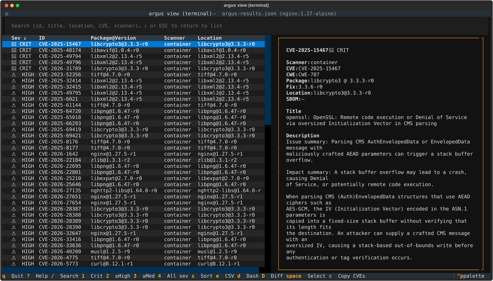
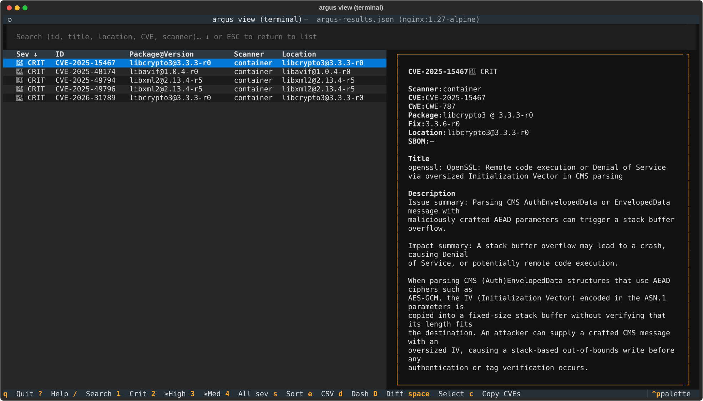
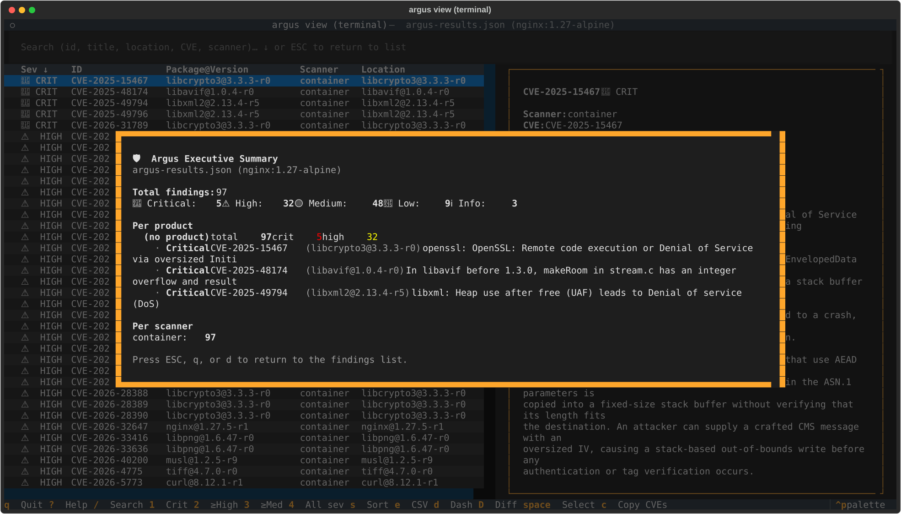
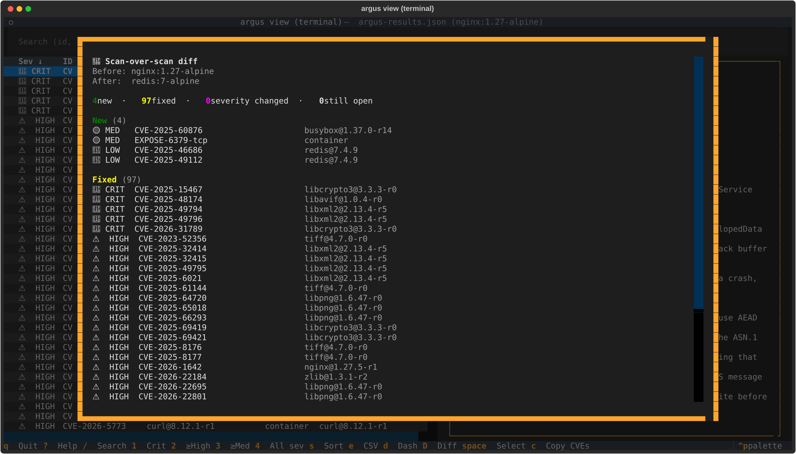
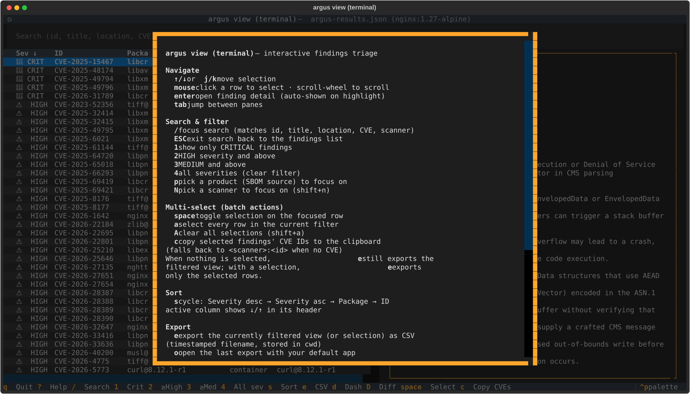
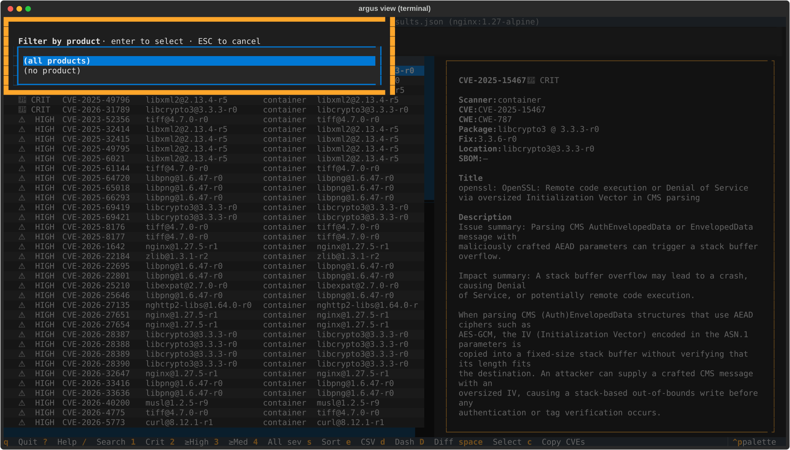

# `argus view terminal` — interactive findings triage

After a scan produces `argus-results.json`, reading the raw file in an editor
or paging through the linear Markdown report is a poor way to triage.
`argus view terminal` is a full-screen terminal UI for *navigating* findings: filter by severity,
product, or scanner; search by CVE; drill into details; export the filtered
subset; see an executive summary — all with keyboard shortcuts.

Ships behind an optional extra so CI/server installs of argus stay
lightweight.

## Install

```bash
pip install 'argus-security[terminal]'
```

The extra pulls in [Textual](https://textual.textualize.io/) (~2 MB of Python
deps). Without it, running `argus view terminal` prints a friendly install hint and
exits cleanly — the extra is never required for `argus scan` or any other
subcommand.

## Launch

```bash
argus view terminal                          # loads ./argus-results/argus-results.json
argus view terminal ./run-2026-04-24         # specific results directory
argus view terminal ./custom-results.json    # direct file path
```

### One-flag scan → browse workflow

```bash
argus scan --interface=terminal              # scans, then opens the terminal viewer on the output
argus scan --sbom data/ --interface=terminal # batch-scan a directory of SBOMs, then browse
```

The `--interface=terminal` flag takes effect after the scan completes and the
manifest is finalized. If the `[terminal]` extra isn't installed, the scan
still succeeds; only the viewer launch is skipped with a note.

## Keyboard reference

Press `?` inside the TUI for the same reference, grouped by purpose.

| Key | Action |
|-----|--------|
| **Navigate** | |
| `j` / `k` or `↑` / `↓` | move selection |
| `tab` | jump between panes |
| **Search & filter** | |
| `/` | focus search (matches id, title, location, CVE, scanner) |
| `ESC` | exit search back to the findings list |
| `1` | show only CRITICAL findings |
| `2` | HIGH severity and above |
| `3` | MEDIUM severity and above |
| `4` | clear severity filter (all) |
| `p` | pick a product (SBOM source) to focus on — modal |
| `N` (shift+n) | pick a scanner to focus on — modal |
| **Multi-select (batch actions)** | |
| `space` | toggle selection on the focused row |
| `a` | select every row in the current filter (additive) |
| `A` (shift+a) | clear all selections |
| `c` | copy selected findings' CVE IDs to the clipboard |
| **Sort** | |
| `s` | cycle: severity desc → asc → package → id (toast + header arrow) |
| **Export** | |
| `e` | export visible findings (or selection) as CSV |
| `o` | open last export with your default app |
| `r` | reveal last export in file manager |
| **Other** | |
| `d` | executive dashboard overlay |
| `D` (shift+d) | scan-over-scan diff — pick another `argus-results.json` and bucket changes |
| `?` | help overlay |
| `Ctrl+P` | command palette (fuzzy-search every action) |
| `q` | quit |

JSON, Markdown, and SARIF exports are available via `Ctrl+P` → type
`Export: JSON` / `Export: Markdown` / `Export: SARIF`. The filename
convention is `argus-findings-YYYYMMDD-HHMMSS-<severity>.<ext>` so repeated
exports at different filters never clobber each other.

## Mouse interactions

Every visible piece of state in the TUI is a click target. Keyboard
bindings keep working in parallel — these are additive, not a
replacement.

| Surface | Mouse action | What it does |
|---|---|---|
| Findings table — row | hover | Subtle highlight on the row under the cursor |
| Findings table — row | left-click | Move the cursor + update the detail pane |
| Findings table — row | second left-click on focused row, **or** right-click | Open the context menu for that finding |
| Findings table — column header | left-click | Cycle sort (same modes as `s`) |
| Detail pane — CVE / GHSA ID | left-click | Open the upstream advisory page in your default browser |
| Detail pane — `file:line` value | left-click | Open the file at that line (mode controlled by `view.open_location` — see below) |
| Detail pane — `package@version` value | left-click | Open the package's PyPI or npm registry page |
| Status bar — severity chip | left-click | Clear the severity filter (back to "all") |
| Status bar — product / scanner / query chip | left-click | Clear that one filter |
| Status bar — sort chip | left-click | Cycle sort modes (same as `s`) |
| Footer — keybind hint | left-click | Run the same action the key would |

### Context menu actions

The right-click / second-click menu lists only the actions that apply
to the focused finding (no "open file" entry for a Bandit finding that
has no location, etc.):

- **Open advisory** — opens the CVE or GHSA in your browser
- **Open file in local editor** — shells out to `$VISUAL` / `$EDITOR`
  / VS Code (`code -g file:line`) / fallback to `xdg-open` / `open`
- **Open file on remote (git blob URL)** — opens the file at the
  scan's commit SHA on the repo's `origin` remote (GitHub, GitLab,
  or self-hosted of either)
- **Open package on registry** — PyPI for plain names, npm for
  scoped (`@scope/pkg`) shapes
- **Copy CVE to clipboard** — only shown for CVE-bearing findings
- **Export current selection / view** — same path as the `e` key

### Configuration (`argus.yml` → `view:`)

Defaults are tuned for a developer workstation with Git, a browser,
and an editor available. The three knobs:

```yaml
view:
  cve_source: nvd          # nvd | cve_org | github | mitre
  open_location: ask       # ask | local | remote
  editor: ""               # override $EDITOR (e.g. "code -g", "nvim", "subl -w")
```

- `cve_source` — where clicked CVE IDs land. Default `nvd`
  (`nvd.nist.gov/vuln/detail/<CVE>`). GHSA IDs always route to
  `github.com/advisories/<GHSA>` regardless of this setting.
- `open_location` — how clicked `file:line` cells resolve. Default
  `ask` pops a tiny modal letting you pick local or remote per
  click. `local` always shells out to your editor. `remote` always
  constructs a git blob URL at the scan's recorded commit SHA.
- `editor` — explicit editor command. When unset, falls through to
  `$VISUAL` → `$EDITOR` → VS Code on PATH → `xdg-open` / `open`.
  VS Code's `code -g file:line` goto-line form is special-cased; vim
  / nvim / emacs / nano use `+<line> <file>`.

## Views

### Findings list (default)

Two-pane layout: table of findings on the left, detail of the currently
highlighted row on the right. The status bar lists every active filter
(severity, product, scanner, query) plus the current sort mode.



Press `3` to drop to medium-and-above only — useful when triage hurts:


`1` narrows further to criticals only, the natural starting point on a
fresh scan:



### Executive dashboard (`d`)

Modal overlay aimed at owners / managers / execs who want a one-screen
answer to "what's the state of our security posture?":

- Total findings with per-severity breakdown (Critical / High / Medium /
  Low / **Info** — Info covers attack-surface signal like declared
  EXPOSE ports and enumerated services, not just CVEs)
- Quality warnings — SPDX-2.1 SBOMs Trivy can't read, SBOMs missing purl
  refs, Grype's "couldn't identify scan subject" warnings — surfaced loudly
  so an empty scan isn't misread as "we're clean"
- Per-product breakdown — every SBOM source with total + crit + high counts
  and the top-3 findings
- Per-scanner contribution counts



Dismiss with `ESC`, `q`, or `d` again.

### Scan-over-scan diff (`D` — shift+d)

Modal overlay for the most common follow-up question after "what's
there now?": *what changed since the last run?*

`D` opens a small picker where you type or paste a path to another
`argus-results.json` (or its containing run directory). On submit the
TUI loads the second scan and renders four buckets, with counts at the
top:

| Bucket | Meaning |
|--------|---------|
| **New** | finding present in the current scan only — fresh issue introduced since the comparison |
| **Fixed** | finding present in the comparison only — resolved between runs |
| **Severity changed** | same `(scanner, id, location)` identity tuple in both, but the severity rating shifted (e.g. CVE re-scored MEDIUM → HIGH) |
| **Still open** | identity tuple matches AND severity unchanged — finding persists |

Identity is the `(scanner, id, location)` tuple — bucketing logic
lives in `argus.core.findings_view.diff_scans` and is shared with the
browser interface's `/diff` route, so both surfaces stay aligned.



Dismiss with `ESC`, `q`, or `D` again. The browser interface
(`argus view browser` → `/diff`) renders the same buckets if you'd
prefer a wider canvas with clickable rows.

### Help overlay (`?`)

Grouped keyboard reference with a one-line explanation of each binding.
Dismiss with `ESC`, `q`, or `?` again.



### Pickers — Product (`p`) / Scanner (`shift+n`)

Filter the table to a single product (per-SBOM source) or a single
scanner. The picker lists every value present in the current results
with its row count; selection updates the status bar and the table in
one keystroke. `Esc` dismisses without applying.




### Command palette (`Ctrl+P`)

Textual's built-in fuzzy-search launcher. Every `argus view terminal` action is
registered as a command — type "sort", "filter", "export", "dashboard",
"product", etc. to find them. Textual's own commands (Keys help, Theme
switcher, Screenshot-as-SVG) also appear.

The **Screenshot** command is genuinely useful: saves the current TUI view
as an SVG you can drop into a ticket or doc — better than cropping a
terminal screenshot manually.

## Multi-select for batch actions

Triage workflows often want to act on a subset of findings — export N
rows as CSV for a spreadsheet, or paste a list of CVE IDs into a
bug-tracker comment. The TUI keeps a per-session selection set you can
build with `space` / `a` / `A`:

| Key | Action |
|-----|--------|
| `space` | toggle selection on the focused row (adds a `✓` glyph in the leading column) |
| `a` | select every visible row (additive — preserves any cross-filter picks) |
| `A` (shift+a) | clear every selection |
| `c` | copy selected findings' CVE IDs to the clipboard, one per line |

The status bar shows `<N> selected` whenever the selection is
non-empty. Selection survives filter changes — a row that gets
filtered out and back retains its mark.

### How `e` and `c` use the selection

- **`e` (Export)** — when the selection is non-empty, the export
  writes only the selected rows; the filename's scope marker is
  `selection`. With nothing selected, `e` keeps its original behavior
  (writes the entire filtered view).
- **`c` (Copy CVEs)** — copies the CVE IDs of the selected rows.
  Findings without a CVE (SAST, secret-scanner) fall back to
  `<scanner>:<id>` so each line is still identifiable. Order is
  visible-rows-first, then any cross-filter selections, so the paste
  reflects what you saw on screen.

### Clipboard fallback chain

The TUI tries each mechanism in order until one succeeds, then names
the winner in the toast:

| Platform | Order |
|----------|-------|
| Any | `pyperclip` (when installed) |
| macOS | → `pbcopy` |
| Linux | → `xclip -selection clipboard`, then `wl-copy` (Wayland) |
| Windows | → `clip` |

If nothing works (e.g. headless Linux without `xclip`/`wl-copy`),
the TUI shows a graceful "no clipboard mechanism available" toast
rather than crashing — install `pyperclip` (`pip install pyperclip`)
or your distro's clipboard CLI to enable it.

## Export formats

All four writers take the currently filtered view. Pick via keyboard shortcut
(`e` for CSV) or the command palette for the others.

| Format | Best for | Produces |
|--------|----------|----------|
| **CSV** | Spreadsheet work, bulk ticket upload | `argus-findings-<stamp>-<scope>.csv` |
| **JSON** | Scripting, downstream automation | `argus-findings-<stamp>-<scope>.json` — list of `Finding.to_dict()` objects, identical shape to `argus-results.json` per-finding records |
| **Markdown** | Ticket bodies, PR descriptions | `argus-findings-<stamp>-<scope>.md` — table with severity icons, pipe-escaped cells |
| **SARIF** | Security dashboards, GitHub Code Security | `argus-findings-<stamp>-<scope>.sarif` — SARIF 2.1.0, per-scanner runs, severity→level mapping |

Exports write to the current working directory. `.gitignore` patterns
(`*.csv` and `argus-findings-*.{json,md,sarif}`) cover them in the argus
repo; add similar rules to downstream projects where you run `argus view terminal`.

## Platform notes

- **macOS**: `o` opens with the file's default app (Numbers for `.csv`,
  your Markdown viewer for `.md`); `r` reveals in Finder via `open -R`.
- **Windows**: `o` uses `cmd /c start`; `r` uses `explorer /select,<path>`
  (highlights the file in Explorer).
- **Linux**: `o` uses `xdg-open`; `r` opens the parent directory via
  `xdg-open` — there is no portable "select file" verb across file managers.

All opener invocations go through `subprocess.Popen` with an argv list, not a
shell string, so paths with spaces, quotes, or special characters are safe.

## Troubleshooting

**`argus: error: argument command: invalid choice: 'browse'`** — your `argus`
binary was installed before `browse` landed. Reinstall: `pip install -e
'.[browse]'` in a dev checkout, or `pip install --upgrade 'argus-security[terminal]'`.

**TUI shows "Could not find argus-results.json"** — you haven't run a scan in
the target directory yet, or the scan used a different `--output-dir`. Run
`argus scan --format json` first, or pass the results path explicitly.

**Command palette shows only Textual builtins** — your install is missing the
argus-specific command provider. Reinstall the branch or ensure you're
running the venv's `.venv/bin/argus` rather than a shim from a system
install.

**I want to open with a different app, not my system default** — `o` honors
your OS's file-type associations. Change those in Finder (macOS, "Get Info" →
"Open With"), via `xdg-mime` on Linux, or via File Explorer on Windows.

## Related

- [`argus scan`](cli-reference.md#argus-scan) — produces the
  `argus-results.json` that `argus view terminal` loads
- [`argus report`](cli-reference.md#argus-report) — regenerate terminal /
  markdown / JSON / SARIF output from an existing results directory without
  re-running scanners
- [SDK roadmap](developer/SDK-ROADMAP.md) — tracked follow-ups (multi-select,
  scan-over-scan diff, `argus summary` standalone command, `argus view browser` web
  view sharing the same `findings_view` module)
